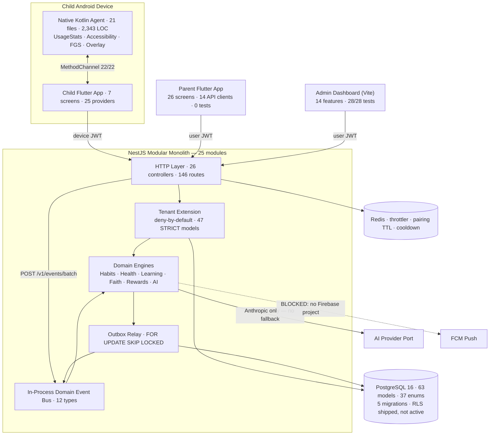
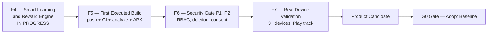

# ابني — EBNEY · حالة المشروع (Project Status)

**AI-Powered Family Digital Coach & Family Operating System**

> **«ابني لا يراقب الطفل فقط، بل يساعد الوالد على بناء طفل أفضل.»**

| Field | Value |
|---|---|
| Document ID | `EBNEY-STATUS-01` |
| Version | 1.0 |
| Owner Role | Technical Program Manager |
| Status | **Final — الوثيقة المرجعية الأولى لأي مهندس جديد أو stakeholder** |
| Last Updated | 2026-08-15 |
| Branch | `abny/sprint-f1-unblock` |
| Commit | `695aab0` — *Sprint F3: the missing architectural spine — Domain Event Bus, Outbox, /v1/events/batch* |
| Remote state | **لم يُدفَع قط.** `origin` يحمل `main` فقط؛ فرع F1/F2/F3 محلي بالكامل ⇒ **صفر تشغيلة CI في تاريخ المشروع** |
| قاعدة الأدلة | `A0-Audit-Verdict` · `A1`–`A4` · `F1-Backend` · `F1-Mobile` · `F2-Tenant` · `F2-Mobile` · `F3-Event-Pipeline` · **قياس مباشر على هذا الـ commit** |

**تصنيف الأدلة المستخدَم في كل جداول هذه الوثيقة** (`CONTEXT.md` §3 مبدأ 9):
`TESTED` = نُفِّذ فعليًا ومخرجه مذكور · `CODE VERIFIED` = قُرئ/فُحص ستاتيكيًا ولم يُنفَّذ · `BLOCKED` = تعذّر التنفيذ — **BLOCKED ≠ PASS** · `NOT BUILT` = لا مقابل في الكود.

---

## 0. تغيير التسمية: `ABNY` ➜ **`EBNEY`** — قرار مفتوح وواجب

الوثائق السابقة كلها (`CONTEXT.md`، التدقيقات الأربعة، تقارير F1–F3) تكتب الاسم **`ABNY`**. هذا التكليف يعتمد **`EBNEY`**.

**القرار المسجَّل هنا: `EBNEY` هي الصيغة القانونية (canonical) من اليوم.** ما دون ذلك تركة تُنظَّف.

| البند | القياس على هذا الـ commit | الحكم |
|---|---|---|
| ملفات تحتوي `abny` (خارج `node_modules`/`.git`) | **23 ملفًا** — منها `packages/shared-types`، `common/tenancy/tenant.extension.ts`، `system-route.decorator.ts`، `build-apk.yml`، `app_config.dart` في التطبيقين، `docs/release/PLAY_POLICY_DECLARATION.md` | `TESTED` (grep) |
| ملفات تحتوي `ebney` | **0** | `TESTED` |
| دور قاعدة البيانات في `0004_tenant_rls_defence_in_depth` | `abny_app` — **اسم داخل migration مشحونة** | `CODE VERIFIED` |
| Rebrand الـ backend | قُدِّر بـ **2–3 أيام** (‏`A0` §3.2) — رخيص، صفر بادئة جداول في الـ DB | تقدير قائم |
| **Android package** | **`com.aifamilycoach.child_app`** في `build.gradle` (‏`namespace` + `applicationId`) وفي شجرة الـ Kotlin كاملة | 🔴 **القيد الحقيقي** |

> **القيد الملزِم:** اسم حزمة Android **غير قابل للتغيير بعد أول نشر على المتجر** — تغييره يعني **تطبيقًا جديدًا بلا مسار ترقية** للمستخدمين القائمين. لذلك: **قرار مكتوب من مالك المنتج على الاسم النهائي (`com.ebney.*` أم إبقاء `com.aifamilycoach.*`) مطلوب قبل أي رفع إلى Play Console، لا بعده.** مهلة القرار 48 ساعة، وهو من البنود المحجوبة على العميل.
>
> **rename sweep مهمة مفتوحة** ولم تبدأ. نطاقها: 23 ملفًا + دور DB + وثائق + (بقرار منفصل) حزمة Android.

---

## 1. المعمارية الفعلية اليوم

### 1.1 شكل الـ Monorepo

```
FamilyOS/
├── apps/
│   ├── backend/          NestJS 10 + Prisma 5.22 + PostgreSQL 16 + Redis   (25 modules)
│   ├── child-app/        Flutter + Native Kotlin Agent (21 ملف Kotlin)
│   ├── parent-app/       Flutter
│   └── admin-dashboard/  React 18 + Vite + TanStack Query + zustand + Tailwind
├── packages/
│   └── shared-types/     إعادة تصدير لعقود الأحداث (ليست حزمة workspace حقيقية)
├── docs/                 86 ملف Markdown
├── scripts/
├── .github/workflows/    ci.yml (يستدعي) · build-apk.yml   ← لم تُشغَّل أي منهما قط
└── docker-compose.yml
```

**تحفّظ معماري صريح:** `CONTEXT.md` §2 يقفل **Nx / pnpm workspaces**. الواقع: `apps/backend` بـ `npm` مستقل، و`packages/shared-types` **إعادة تصدير سطرية** لا حزمة (‏`F3` §R3-5). أي أن الـ monorepo **اسم مجلدات لا أداة بناء**. كذلك `CONTEXT.md` §2 يقفل **Next.js 14 + shadcn/ui** للـ Admin Dashboard، والموجود **Vite SPA** — انحراف معلَن يحتاج ADR مكتوبًا.

### 1.2 مخطط الحاويات (Container Diagram)



### 1.3 طبقة البيانات

- **63 model · 37 enum · 2,193 سطرًا** في `schema.prisma` (‏`TESTED` — عدّ مباشر).
- **5 migrations**، كلها مطبَّقة ومُثبتة بالتنفيذ على PG16: `0001_init` (60 جدولًا · 76 FK · 150 index) · `0002_rewards_integrity_constraints` · `0003_tenant_isolation_family_id` (‏`family_id` من 10/60 إلى 49/60) · `0004_tenant_rls_defence_in_depth` (‏45 جدولًا · 90 policy) · `0005_event_backbone`.
- **تصنيف المستأجر مُنفَّذ كودًا لا نثرًا:** 63 model مصنَّفة بالكامل ⇒ **47 STRICT · 1 SHARED-NULL · 4 PLATFORM-ANNOTATED · 1 SELF-TENANT · 10 GLOBAL** — مخرج `npm run ci:tenant-guard` حرفيًا، **0 violations** (`TESTED`).
- **RLS مشحونة ومُثبتة، وغير مُفعَّلة:** التطبيق لا يعمل بالدور المقيَّد `abny_app`؛ تفعيلها يحتاج transaction-per-request (قرار سعة مفتوح).

### 1.4 خط أنابيب الأحداث (F3)

المسار المعياري في `CONTEXT.md` §5 **مبنيّ ومُثبت بالتنفيذ**:

```
Child Device → POST /api/v1/events/batch (device JWT, tenant من التوكن)
  → In-Process Domain Event Bus (typed, 12 event types)
  → Outbox (نفس الـ transaction, at-least-once, backoff, DEAD letter)
  → Rewards Engine (INSERT … ON CONFLICT DO NOTHING)
       ↳ لم تُمنح مكافأة فعليًا ⇒ صفر إشعار
  → Smart Notification Decision Engine → (FCM — BLOCKED)
```

إعادة إرسال نفس الدفعة ⇒ **صفر مكافأة جديدة وصفر إشعار جديد** — مقيس لا مُدّعى.

---

## 2. التطبيقات الأربعة — ما تفعله فعلًا اليوم

| السطح | الحجم المقيس | ما يفعله فعلًا | النضج |
|---|---|---|---|
| **Backend (NestJS)** | 322 ملف TS · 21,626 سطرًا في `src` · 26 controller · 146 route | Auth + rotation + reuse detection · Pairing كامل بـ Risk/Trust · محركات Habits/Health/Learning/Faith/Rewards · AI orchestration · Event pipeline · Tenant isolation إجباري | 🟢 **7/10** — أنضج سطح في المستودع، ومُثبَت بـ 1,176 اختبارًا |
| **Child Flutter App** | 6,646 سطرًا · 7 شاشات · 25 provider · 11 ملف اختبار | Onboarding + consent · pairing + heartbeat · runtime coordinator (لا يقرّر حظرًا — ينفّذ فقط) · عربية عامية مصرية دافئة | 🟠 **4/10** — الكود موجود ومتماسك، **صفر تشغيل** |
| **Native Kotlin Agent** | 21 ملفًا · 2,343 سطرًا · **صفر stub** | `UsageStatsManager` حقيقي · `AccessibilityService` · Foreground Service · Overlay غير عقابي بالعربية · Keystore EC secp256r1 · anti-tamper · جسر 22/22 | 🟠 **5/10** — أعلى كثافة قيمة/سطر في المستودع، **صفر تنفيذ على أي جهاز** |
| **Parent Flutter App** | 6,580 سطرًا · 26 شاشة · 14 عميل API · **0 ملف اختبار** | Login/Register · إنشاء أسرة · إضافة طفل · لوحة · إشعارات · إعدادات · سياسات | 🔴 **3/10** — الأوسع سطحًا والأقل تحققًا؛ **بلا اختبار واحد** |
| **Admin Dashboard** | 58 ملف TS/TSX · 4,034 سطرًا · 14 feature | إدارة داخلية: children · devices · pairing · screen-time · notifications · reports · insights · search | 🟢 **6/10** — الوحيد الذي **يُبنى ويُختبر فعلًا** (‏28/28 `TESTED`) |

---

## 3. جرد الـ Modules في الـ Backend (25)

> LOC = أسطر الإنتاج (‏`.ts` غير `.spec.ts`). عمود «Tests» = عدد الاختبارات المُنفَّذة في مجلد الاختبار المقابل (مخرج `jest --json`، لا تقدير).

| # | Module | LOC | Tests | النضج | الغرض في سطر |
|---|---|---|---|---|---|
| 1 | `life-intelligence` | 6,140 | 353 | 🟠 God Module | ثمانية domains (Habits · Health · Learning · Faith · Rewards · Timeline · Messages · Tasks) في وحدة واحدة — **المحتوى أثمن ما في المستودع والشكل مخالف لحدود `CONTEXT` §2** |
| 2 | `pairing` | 2,797 | 101 | 🟢 ناضج | اقتران الجهاز بـ 7 خطوات + Risk + Trust + State Machine — **أنضج module** |
| 3 | `events` | 1,984 | 94 | 🟢 جديد ومُثبت | Domain Event Bus + Outbox + `/v1/events/batch` + 3 consumers (F3) |
| 4 | `ai-core` | 1,621 | 56 | 🟠 قوي/ناقص | 7 محركات AI + `AI_PROVIDER` port + CircuitBreaker — **Anthropic فقط، بلا fallback، وكل الـ prompts إنجليزية** |
| 5 | `organization` | 1,224 | 52 | 🔴 خصم | منصة B2B2C كاملة داخل MVP يستبعد B2B — **DELETE (3 أيام)**، ينتظر قرار مالك المنتج |
| 6 | `auth` | 1,071 | 29 | 🟠 جيد/ناقص | JWT + rotation + reuse detection + Argon2id — **بلا RBAC وبلا `familyRole` في الـ JWT** |
| 7 | `billing` | 1,055 | 42 | 🔴 واجهات فقط | 6 محوّلات دفع **كلها ترمي `PaymentProviderNotConfiguredException`**؛ صفر SDK دفع |
| 8 | `screen-time` | 470 | 15 | 🟡 يعمل | سياسات وقت الشاشة — بلا `version`/`If-Match` وبلا تاريخ إصدارات |
| 9 | `compliance` | 367 | 8 | 🟠 مُسجِّل لا مُنفِّذ | Consent مُسجَّل؛ **يُفحص في موضع واحد من ~60 مسار كتابة** |
| 10 | `children` | 328 | 10 | 🟡 رقيق | CRUD الطفل + `assertChildBelongsToFamily` |
| 11 | `analytics` | 288 | 3 | 🟡 هيكل سليم | port + adapters + privacy filter — بلا funnels ولا retention |
| 12 | `data-retention` | 251 | 5 | 🔴 كود ميت | 4 سياسات احتفاظ حقيقية · `enforceAll()` **«Not scheduled anywhere itself»** |
| 13 | `system-diagnostics` | 231 | — | 🟢 مقبول | فحوص تشغيلية |
| 14 | `support` | 202 | 5 | 🟢 مقبول | طلبات الدعم |
| 15 | `notifications` | 165 | 4 | 🟠 مشتّت | قراءة الإشعارات فقط؛ `FatigueGuard` و`DecisionEngine` داخل `life-intelligence` و FCM داخل `pairing` |
| 16 | `reports` | 159 | — | 🔴 خصم | fan-out على 4 modules بلا منطق خاص — **DELETE (يوم)** |
| 17 | `profile` | 149 | 3 | 🟡 رقيق | GET/PATCH فقط |
| 18 | `account-deletion` | 137 | 7 | 🔴 معطوب دلاليًا | يغطي **6 من 63 model**، ولا يُلغي device tokens ⇒ جهاز الطفل يبقى 30 يومًا بعد «حذف الحساب» |
| 19 | `feature-flags` | 129 | 5 | 🟢 REUSE | أعلام ميزات |
| 20 | `settings` | 126 | 3 | 🟢 REUSE | إعدادات المستخدم |
| 21 | `search` | 104 | — | 🟡 مقبول | بحث — يحتاج `ILIKE` عربي وتنظيف `any` |
| 22 | `ai-assistant` | 78 | 2 | 🟡 يُدمج | واجهة رقيقة فوق `ai-core` |
| 23 | `health` | 72 | 5 | 🟢 REUSE | liveness/readiness — **يُعاد تسميته `platform`** (تضارب اسمي مع Health المستهدف) |
| 24 | `audit` | 61 | — | 🔴 REBUILD | `AuditLog` بلا read API وبلا اختبارات؛ `familyId` أُضيف في F2 لكن **لا يُملأ** |
| 25 | `consent-check` | 49 | — | 🔴 خصم | موجود فقط لكسر دورة import — **DELETE (0 يوم)** |

**مجلدات اختبار عابرة للـ modules:** `tenancy` **310** اختبارًا · `database` **26** · `common` **28** · `config` **9**.

**الـ Modules الغائبة كليًا مقابل `CONTEXT` §4:** `Families` (‏model موجود، **صفر service وصفر controller**) · `Parents` (‏لا co-parent ولا أدوار) · `Devices` (‏موزّع بين `auth` و`pairing`، لا module مستقل) · `Tasks` كما يعرّفه الهدف (الموجود مولّد اقتراحات AI، عكس المطلوب).

---

## 4. الميزات القائمة — ما يعمل فعلًا

| الميزة | الحالة | الدليل |
|---|---|---|
| بناء قاعدة البيانات من الصفر | **`TESTED`** | 5 migrations على PG16 نظيف · `0001_init` ⇒ 60 جدولًا · 76 FK · 150 index · exit 0 |
| تسجيل/دخول + Refresh Token Rotation + **reuse detection يُبطل السلسلة كاملة** | **`TESTED`** | `token.service.spec` + `refresh-token-family.integration.spec` على Postgres حقيقي |
| اقتران آمن للجهاز (Risk + Trust + State Machine + مسار واحد فقط) | **`TESTED`** | 101 اختبارًا؛ المسار القديم أحادي-الخطوة **حُذف** ومُثبت بالبنية |
| مسارات الطفل `/self/*` تعمل بتوكن الجهاز | **`TESTED`** | 6 اختبارات HTTP حقيقية + 66 بوابة بنيوية — كانت **25 مسارًا ترجع 401 للجميع** |
| Idempotency للمكافآت + منع الرصيد السالب في الاستبدال | **`TESTED`** جزئيًا | 8 طلبات متزامنة ⇒ **مكافأة واحدة**؛ 6 موافقات ⇒ رصيد 0 و`SUM(delta)` = الرصيد. ⚠️ العقد يفرض **50** طلبًا — لم تُعَد التشغيلة بعد |
| Rate limiting حقيقي per-identity (‏trust proxy + Redis Lua) | **`TESTED`** | 10 اختبارات منها control يثبت العطل القديم |
| **Tenant isolation إجبارية** (‏Prisma `$extends` deny-by-default) | **`TESTED`** | 310 اختبار `tenancy` · 55 مسارًا بتوكن العائلة الخطأ ⇒ **50×404 · 3×401 · صفر 200** |
| RLS كطبقة دفاع ثالثة | **`CODE VERIFIED`** | 45 جدولًا · 90 policy مشحونة ومُثبتة على دور غير-superuser — **التطبيق لا يعمل بذلك الدور** |
| Domain Event Bus + Outbox + `POST /v1/events/batch` | **`TESTED`** | 94 اختبارًا · السلسلة كاملة من جهاز حقيقي · replay ⇒ صفر مكافأة وصفر إشعار |
| مسار Habits و Education/Faith **من الجهاز** عبر المحرك | **`TESTED`** | end-to-end مع `STREAK_ACHIEVED` كحدث مشتق |
| بوابة موافقة الوالد على رسائل الـ AI (`ai-draft → approve/reject`) | **`CODE VERIFIED`** | تنفيذ حرفي لـ `CONTEXT` §3.2 — لا اختبار e2e يمرّ عبر الشبكة |
| محركات Health/Habits/Learning/Faith (‏تغذية، ترطيب، نوم، نشاط، streaks) | **`CODE VERIFIED`** | مغطّاة بـ unit tests داخل 353 اختبار `life-intelligence`؛ **مسار الكتابة من التطبيق غير مُختبَر عبر HTTP** |
| Admin Dashboard | **`TESTED`** | `vitest run` ⇒ **28/28 · 4 ملفات · exit 0** (نُفِّذ في 2026-08-15) |
| TypeScript يُترجم نظيفًا | **`TESTED`** | `npx tsc -p tsconfig.build.json --noEmit` ⇒ **exit 0 · صفر diagnostic** |
| حارسا CI: tenant-scoping · event-emission | **`TESTED`** | كلاهما `0 violations` (نُفِّذا في 2026-08-15) |
| Child/Parent Flutter Apps — **أي شيء يحتاج Dart SDK** | 🔴 **`BLOCKED`** | صفر `flutter pub get`/`analyze`/`test`/`build` في تاريخ المشروع |
| Flutter — التحقق الثابت (Phase C) | **`STATIC VERIFIED`** | `scripts/dart_preflight.py`: 12 فحصًا · 677 نداء مُنشئ · 194 مرجع عضو · 195 سلسلة وراثة داخل الشجرة ⇒ **0 error / 0 warning** بعد إصلاح 7 أعطال. الضوابط السالبة **12/12** |
| Kotlin Agent على جهاز حقيقي | 🔴 **`BLOCKED`** | صفر تنفيذ · صفر اختبار Kotlin (0 ملف) |
| FCM push إلى جهاز حقيقي | 🔴 **`BLOCKED`** | لا مشروع Firebase ولا `google-services.json` |
| `npm ci` (تثبيت نظيف) | 🔴 **فاشل اليوم** | `EUSAGE`: الـ lockfile خارج التزامن — ناقص `@prisma/adapter-pg@5.22.0`، `@prisma/driver-adapter-utils@5.22.0`، `postgres-array@3.0.2` |
| `npm run lint` | **`NOT BUILT`** | **لا `eslint` في `devDependencies`** (19 devDep، ولا واحد منها eslint) ⇒ السكربت لم يعمل قط |
| RBAC / أدوار داخل الأسرة | **`NOT BUILT`** | لا `RolesGuard` ولا `@Roles()` ولا `familyRole` في الـ JWT |
| i18n عربي في الـ Backend | **`NOT BUILT`** | **0 ملف من 322 يحتوي محرفًا عربيًا في `src/`** (مقيس) |
| OpenAPI/Swagger · BullMQ/Scheduler | **`NOT BUILT`** | لا `@nestjs/swagger` ولا `bullmq` في `package.json` |

---

## 5. الميزات الناقصة — الفجوة حتى Product Candidate

مرتّبة بالأثر، لا بالجهد.

| # | الفجوة | لماذا تحجب المنتج | الحالة |
|---|---|---|---|
| **1** | **`IMPORTANT_SAFETY_EVENT` يُخزَّن ولا يُنبِّه أحدًا** | الحدث يُقبل ويُكتب في `domain_events` و**لا consumer له**. أي أن **مسار السلامة الفوري — وهو مبرر وجود المنتج — لا ينتج فعلًا واحدًا**. حدّ مُعلَن لا مخفي (`F3` §R3-6) | 🔴 **NOT BUILT** |
| **2** | **مسارات الكتابة من التطبيق تتجاوز الـ Event Bus** | والد أو طفل يضغط «تم» في التطبيق ⇒ صفّ في `habit_completions` **بلا حدث ⇒ بلا مكافأة تلقائية وبلا إشعار**. مسار **الجهاز** موصول ومُثبت؛ مسار **الـ UI** لا. يشمل: `prisma-habit` · `prisma-health` (Hydration/Activity) · `prisma-learning` · `prisma-faith` (Memorization) · `prisma-smart-task` | 🔴 6 مسارات في `KNOWN_UNWIRED` |
| **3** | **RBAC غائب كليًا** | لا أدوار ⇒ **أي `PARENT` = `OWNER`**: يحذف الأسرة، يفكّ اقتران أي جهاز، يقرأ كل شيء. سيناريو «الوالد الخصم» (نزاع حضانة، عنف أسري) **واقعي جدًا في السوق المستهدف** وغير مُعالَج | 🔴 **NOT BUILT** |
| **4** | **حذف الحساب والتصدير لا يعملان E2E** | الحذف يغطي **6 من 63 model**؛ سجلات الصحة والتعلّم والعبادة والدفتر والرسائل تبقى **إلى الأبد**، وjهاز الطفل يحتفظ بجلسة 30 يومًا بعد «حذف الحساب». مخالفة GDPR Art.17 و COPPA | 🔴 **FAIL** |
| **5** | **Retention غير مجدولة** | 4 سياسات فقط (‏notifications 90d · analytics 180d · location · digital-wellbeing 90d) من 63 جدولًا، و`enforceAll()` **لا يستدعيه أحد** — الكود نفسه يعترف: *«Not scheduled anywhere itself»*. لا BullMQ في التبعيات ⇒ **امتثال ادعائي لا آلي** | 🔴 كود ميت |
| **6** | **صفر i18n في الـ Backend** | منتج «عربي أولًا، لا ترجمة» بـ backend **إنجليزي 100%**: **0 ملف عربي من 322**. كل رسائل الأخطاء والإشعارات والـ AI prompts إنجليزية ⇒ الطفل والوالد سيريان إنجليزية في كل مسار يمرّ بالخادم | 🔴 **NOT BUILT** |
| **7** | **لا AI provider fallback** | `CONTEXT` §2 يفرض Anthropic primary + **OpenAI fallback**. الموجود: محوّل Anthropic واحد. انقطاع مزوّد واحد = **توقف كل ميزات الـ Coach**. ولا prompt versioning ولا سقف تكلفة per-family رغم أن `CONTEXT` §6 يفرض ≤ $0.06/أسرة/شهر | 🔴 **NOT BUILT** |
| **8** | **`Families` و`Parents` غير مبنيين** | لا دعوة والد ثانٍ، لا أدوار، لا نقل ملكية. الأسرة اليوم **مفتاح عزل يُنشأ ضمنيًا لا كيان يُدار** | 🔴 **NOT BUILT** (16 يومًا) |
| **9** | **Payments واجهات فارغة** | 6 محوّلات كلها ترمي استثناء «غير مُهيّأ»، وصفر SDK دفع. الـ port عقده **دالة واحدة** `charge()` بينما Paymob يحتاج 6 خطوات وFawry يحتاج مرجعًا غير متزامن ⇒ **الـ port نفسه يُعاد تصميمه** | 🔴 REBUILD (18 يومًا) |
| **10** | **Device attestation غير مُتحقَّق منه** | `attestationChain` **يُخزَّن ولا يُفحص قط**؛ كل إشارات العبث booleans يرسلها الجهاز عن نفسه. الكود يعترف حرفيًا في `verify.dto.ts:48-51` | 🔴 **FAIL** — وهو الـ Wedge نفسه |
| **11** | **لا OpenAPI ولا codegen** | العملاء الـ 14 في تطبيق الوالد مكتوبون يدويًا ⇒ أي إعادة تشكيل للـ 146 مسارًا تكسرهم بصمت. وغيابه سبب مباشر لـ OWASP API9 | 🔴 **NOT BUILT** |
| **12** | **`Consent` مُسجَّل لا مُنفَّذ** | 6 أنواع موافقة معرَّفة، **واحدة تُفحص في موضع واحد** من ~60 مسار كتابة. لا `@RequiresConsent` ولا ConsentGuard | 🔴 **FAIL** |
| **13** | **لا Observability** (`CONTEXT` §2) · **لا Prominent Disclosure** | Sentry + Nest Logger فقط بلا OTel/Pino PII-redacted؛ وخمسة أذونات عالية الحساسية في تطبيق طفل بلا شاشة إفصاح ⇒ **أعلى تصنيف مخاطر ممكن لمراجع Play** | 🔴 **NOT BUILT** |

---

## 6. سجلّ الدَّين التقني

| # | البند | الأثر | الدور المالك | الجهد |
|---|---|---|---|---|
| 1 | تفكيك `life-intelligence` (‏6,140 سطرًا · 8 domains · controller واحد) | كل تغيير يمسّ 8 domains؛ يستحيل امتلاك module بمفرده | Backend Lead | **مضمّن في إعادة بناء الـ modules (≈201 يومًا)** |
| 2 | حذف الخصوم: `organization` (5 جداول + 12 route + feature في الـ dashboard) · `reports` · `consent-check` · جداول Location · `KEYBOARD_BEHAVIOR_ANALYSIS` | **الجداول لا الكود** هي المشكلة: كل migration لاحق يحملها، وتعليق `schema.prisma` يقترح تحويل `Family` إلى `Organization{type:FAMILY}` ⇒ مهندس جديد يبني نموذج الأسرة على مسار مرفوض | Backend Lead + Product Owner | **7 أيام** — وكلفتها تنمو أُسّيًا مع كل migration |
| 3 | لا `eslint` ولا config رغم وجود سكربت `lint` في `package.json` | **صفر فحص أسلوب/جودة آلي** في backend بـ 21,626 سطرًا؛ والـ README يدّعي «lint clean» | DevOps | **1 يوم** |
| 4 | `npm ci` فاشل (lockfile خارج التزامن) | **`ci.yml` سيفشل في أول خطوة عند أول push** — الخطوة الأولى في الـ pipeline حرفيًا | Backend Lead | **0.25 يوم** |
| 5 | 14 عميل API مكتوب يدويًا في تطبيق الوالد | إعادة تشكيل الـ 146 مسارًا تُبطلهم بصمت؛ الوفر المقدَّر (16 يومًا) **يتبخّر لو نُفِّذت متأخرة** | Flutter Lead | **8 أيام** (توليد من OpenAPI) |
| 6 | `RewardsAccount` كمصدر حقيقة موازٍ لـ `pointsCacheVal` | مصدرا حقيقة للرصيد ⇒ انحراف غير قابل للتصحيح | Backend Lead | **2 يوم** |
| 7 | ثلاثة سجلات تدقيق متوازية · `AuditLog` بلا read API وبلا اختبارات | تحقيق حادثة لأسرة واحدة = مسح عبر كل المستأجرين | Security Engineer | **6 أيام** |
| 8 | لا partitioning على `domain_events` رغم أن `docs/05` يعلنه · `packages/shared-types` إعادة تصدير لا حزمة · لا Nx/pnpm workspaces | `@@unique([family_id, idempotency_key])` بلا عمود تاريخ ⇒ إعادة حدث الأمس تصطدم اليوم؛ والـ monorepo اسم مجلدات لا أداة بناء | Data Eng + DevOps | **7 أيام** |
| 9 | Notification Decision Engine يقرأ **ساعة الخادم** لا منطقة الأسرة الزمنية | quiet hours ستُخطئ لكل أسرة خارج UTC — أي **كل السوق المستهدف** | Backend Lead | **2 يوم** |
| 10 | `@SystemRoute` مخرج قوي يتخطى الـ tenant extension (13 استخدامًا) بلا اختبار يفشل إن نمت القائمة | القائمة ستنمو بصمت | Security Engineer | **1 يوم** |
| 11 | خطوط Fredoka/Inter **لا تدعم العربية** · تباين السجل اللغوي (Flutter عامية مصرية مقابل Kotlin فصحى، والطفل يرى الاثنين) | انهيار الهوية البصرية في اللغة الأولى للمنتج؛ والثاني قرار منتج لا هندسة | UX + Flutter + PO | **1.5 يوم + قرار** |
| 12 | لا `pubspec.lock` (‏`analysis_options.yaml` أُجّل عمدًا لِما بعد أول ناتج أخضر) | البناء **غير حتمي**: بناءان متتاليان قد يستخدمان شجرتي تبعيات مختلفتين. Phase C جعل الـ CI **يولّد الملف ويرفعه**؛ يبقى على العميل **تنزيله والتزامه** — دورة واحدة | Flutter Lead + العميل | **0.25 يوم** |
| 13 | `AiRiskScore` («درجة خطورة يومية للطفل») | **لغة Parental Control العقابي** التي يرفضها `CONTEXT` §1 و§3.7 — أعِد التأطير إلى `WellbeingScore` أو احذف | Product Owner | **1 يوم** |

---

## 7. الوضع الأمني

### 7.1 ما أُغلق بدليل تنفيذي

| البند | الحالة |
|---|---|
| SA-001 — Guard stacking يقتل 25 مسارًا للطفل | ✅ `TESTED` — وأُثبت أن الاختبار **يلتقط الانحدار** بإعادة العطل مؤقتًا |
| SA-002 — Refresh token reuse detection | ✅ `TESTED` — إلغاء عائلة التوكن كاملة + حدث تدقيق؛ الاستجابة للعميل لم تتغيّر عمدًا (وإلا صارت oracle) |
| SA-003 — مسار pairing قديم يُصدر device token في خطوة واحدة | ✅ `TESTED` — حُذف بالكامل، ومُثبت بنيويًا أنه لا مسار في `src/` ينشئ جهازًا `ACTIVE` مباشرة |
| SA-004 — Rate limiting معطّل خلف أي proxy | ✅ `TESTED` — `trust proxy = 1` + Redis Lua ذرّي |
| DA-001 — الـ migration لا تبني القاعدة (13/60، exit 3) · DA-002 — 8 طلبات ⇒ 8 مكافآت و6 استبدالات ⇒ رصيد −500 | ✅ `TESTED` — 5 migrations بـ exit 0؛ والتزامن يُنتج مكافأة واحدة ورصيدًا صحيحًا |
| SA-010 / R8 — Tenant isolation بنيوية | ✅ `TESTED` — extension deny-by-default + 47 STRICT + probe عبر-المستأجرين |
| R14 — fail-open بعد إزالة حارس الـ class | ✅ `TESTED` — الحارس البنيوي عُمِّم على **27 صنف controller · 145 مسارًا**، و10 مسارات عامة لكلٍّ **سبب مكتوب ≥30 حرفًا** |
| R3 — لا Event Bus | ✅ `TESTED` — F3 |

### 7.2 ما لا يزال مفتوحًا

| البند | الحالة |
|---|---|
| RBAC / `familyRole` في الـ JWT / مصفوفة أدوار deny-by-default | 🔴 **FAIL** |
| حذف الحساب E2E عبر 63 model + إلغاء device tokens | 🔴 **FAIL** (6/63) |
| ConsentGuard عند وقت الطلب | 🔴 **FAIL** (1 من ~60 مسار كتابة) |
| Retention jobs تعمل فعليًا | 🔴 **FAIL** (غير مجدولة) |
| `audit_log` غير قابل للتعديل + tenant-aware + PII-redacted | 🔴 **FAIL** (العمود موجود، لا يُملأ، لا read API) |
| Device attestation مُتحقَّق منه server-side (‏Play Integrity) | 🔴 **FAIL** |
| MFA / حسابات إدارية فردية · account lockout · تحقق البريد | 🔴 **FAIL** — مفتاح API واحد مشترك للفريق |
| بوابة CI أمنية حاجبة (lint + SAST + secrets + audit) | 🔴 **FAIL** — لا lint، و`npm audit` عليه `continue-on-error: true` |
| RLS مُفعَّلة (التطبيق بالدور المقيَّد) · Idempotency عند **50** طلبًا (لا 8) | 🟡 **PARTIAL** — الأولى مشحونة وغير مُفعَّلة، والثانية بند تعاقدي يحتاج إعادة تشغيل |
| محور المستأجر الثاني `Organization*` (5 جداول) | 🟠 **بلا أي عزل إجباري** — لا extension ولا RLS |
| `IMPORTANT_SAFETY_EVENT` بلا consumer | 🔴 **NOT BUILT** |

### 7.3 شروط الـ NO-GO — لا تفاوض

> **حكم `A4` نصًّا: NO-GO لأي pilot ببيانات أطفال حقيقيين حتى إنجاز حزمتَي P1 و P2 على الأقل.**

| الحزمة | المتبقّي | البنود |
|---|---|---|
| **P1 — حاجبة للـ Pilot** | **7 أيام** | SA-006 (lockout + تحقق بريد) 3 · **SA-009** (حدّ التاريخ) 2 · SA-011 (Stripe anti-replay) 1 · SA-013 (تجزئة كود الدعوة) 1 |
| **P2 — Authorization & Compliance** | **27 يومًا** | SA-005 RolesGuard 8 · SA-008 حذف حقيقي عبر 63 model 10 · SA-012 ConsentGuard 6 · SA-014 حسابات admin فردية 3 |
| **مجموع البوابة** | **34 يوم-مهندس** | 🔴 **P2 لم يبدأ** |
| P3 — مقاومة الطفل الخصم | 12 يومًا | SA-007 Play Integrity — **قبل GA لا قبل Pilot، لكنه الـ Wedge نفسه** |

> ⚠️ **SA-009 خطر أنشأه الإصلاح نفسه:** `CompleteHabitDto.date` بلا حد أدنى ولا أعلى. كان **كامنًا محجوبًا بـ SA-001**؛ بإغلاق SA-001 صار **قابلًا للاستغلال فعلًا**: طفل بتوكن جهاز يرسل 365 تاريخًا مختلفًا ⇒ **365 مكافأة مشروعة تمامًا من منظور القاعدة**. القيود الجديدة تمنع **التكرار** لا **التزوير الزمني**. **يجب أن يكون البند الأول في الـ sprint القادم.**

> **تشكيل الفريق، لا الميزانية:** `CONTEXT` §6 يخصّص Security **استشاريًا بـ 0.25 FTE**. هذا الحجم لا يُنفَّذ بربع دوام. المطلوب **مهندس أمن بدوام كامل لثلاثة sprints متتالية**.

---

## 8. حالة البناء

### 8.1 الـ Backend — أرقام نُفِّذت على هذا الـ commit (2026-08-15)

| الأمر | النتيجة | التصنيف |
|---|---|---|
| `npx jest --runInBand --forceExit` | **1,176 passed / 1,176 · 90 suites passed / 90 · 0 failed · 0 skipped · exit 0** | **`TESTED`** — نُفِّذ **مرتين** مقابل PostgreSQL 16 و Redis حيّين |
| `npx tsc -p tsconfig.build.json --noEmit` | **exit 0 · صفر diagnostic** | **`TESTED`** |
| `npm run build` (`tsc -p tsconfig.build.json`) | exit 0 | **`TESTED`** — was `npx nest build`, which stopped existing when @nestjs/cli was removed for TypeScript 7 |
| `npm run ci:tenant-guard` | 324 ملفًا · 63 model مصنَّفة · **0 violations** | **`TESTED`** |
| `npm run ci:event-emission` | 322 ملفًا · 9 domain-state models · 6 كتّاب · 6 allowlisted · **0 violations** | **`TESTED`** |
| `npx vitest run` (admin-dashboard) | **28 passed / 28 · 4 ملفات** | **`TESTED`** |
| **`npm ci`** | 🔴 **فشل — `EUSAGE`** | package.json و package-lock.json خارج التزامن |
| `npm run lint` | 🔴 **لا يمكن أن يعمل** | لا `eslint` في التبعيات |

> **ملاحظة تشغيلية على القياس:** جرت ثلاث تشغيلات. الأولى والثالثة **1,176/1,176 · exit 0**. الثانية أظهرت 162 فشلًا **بسبب البيئة لا الكود** — تغيّرت كلمة مرور دور PostgreSQL `afdc` أثناء الجلسة (نشاط متزامن على نفس الآلة) فسقطت 7 مجموعات integration بـ `password authentication failed`. أُعيد التشغيل بالاعتماد الصحيح فعادت **1,176/1,176 · 0 failed**. الرقم المُعتمَد هو **1,176**، وهو **مطابق تمامًا** للرقم المُعلن في `F3-Event-Pipeline-Report.md`.
>
> **تحفّظ إضافي:** `apps/backend/src` قيد التعديل النشط من عمل Sprint F4 المتوازي (`git status` يُظهر `?? apps/backend/src/shared/rewards/` غير متعقَّب). القياس أعلاه لقطة لحظة هذا الـ commit؛ **أعِد تشغيله بعد دمج F4**.

**مسار التطور:** 243 (README) ➜ **649** (‏A4، القياس الأول الحقيقي) ➜ **759** (F1) ➜ **1,078** (F2) ➜ **1,176** (F3، ومُعاد التحقق منه هنا).

### 8.2 الموبايل — الحقيقة بلا تجميل

> **لم يُنفَّذ ولا أمر واحد** من: `flutter pub get` · `flutter analyze` · `dart format` · `flutter test` · `flutter build apk` · `gradle assembleDebug` · `adb` — **في تاريخ المشروع كله**.
>
> **لا يوجد بند واحد مصنَّف `TESTED` في أيٍّ من تقارير الموبايل الثلاثة.** أعلى تصنيف مُستخدَم هو `CODE VERIFIED`.

**السبب:** بيئة البناء لا تحوي Flutter SDK ولا Dart SDK ولا Android SDK، و`pub.dev` و`dl.google.com` و`storage.googleapis.com` و Maven Central **محجوبة (403)**.

| المؤشر | Phase B | **Phase C (الآن)** |
|---|---|---|
| ثقة نجاح **أول** `flutter build apk` — تطبيق الطفل | ≈ 55% | **≈ 68%** |
| ثقة نجاح **أول** `flutter build apk` — تطبيق الوالد | **0%** (كان محجوبًا حتميًا بلا `google-services.json`) | **≈ 62%** |
| ثقة أن **أول** `flutter analyze` يخرج نظيفًا (صفر error) | لم تُقدَّر | **≈ 30%** |
| ثقة أن التطبيق **يعمل** بعد التثبيت | ≈ 35% | **≈ 40%** |

**ما تغيّر في Phase C، وأثره على كل رقم:**

| البند | قبل | بعد |
|---|---|---|
| **تحليل ثابت** | 3 سكربتات (imports · l10n · a11y) | **+12 فحصًا** في `scripts/dart_preflight.py` (arity المُنشئات · named params · statics · enum members · `@override` · رموز غير مستوردة · providers خارج النطاق · imports غير مستعملة · `part`) ولكلٍّ **ضابط سالب** في `dart_preflight_selftest.py` — **12/12 يمرّ** |
| **أعطال حقيقية** | غير معروفة | **7 وُجدت وأُصلحت**: 4 أخطاء ترجمة صريحة (`ApiException` غير مستورد ×2 · `authControllerProvider` غير مستورد · `KidTheme.sage500` غير موجود ×3) و3 `unused_import` (وهي **warnings قاتلة** لأن `--fatal-warnings` افتراضي) |
| **`google-services.json`** | غيابه يفشل بناء الوالد **حتميًا** | **فُكَّ الارتباط** خلف `-Pabny.firebase=auto\|required\|off`. الوالد يُنتج APK debug اليوم، **بلا push** — راجع `docs/release/FIREBASE_SETUP.md` |
| **`compileSdk`/`targetSdk`/`minSdk`** | `flutter.*` ⇒ تتبع تاريخًا لا commit | **حرفية: 34 / 34 / 21**. `ndkVersion` مُبقاة عمدًا (لا يمكن التحقق منها بلا SDK) |
| **اختبارات Flutter** | الوالد **صفر ملف** · الطفل 11 ملف خدمات، صفر widget | **+3 ملفات**، smoke لسطح F4 في التطبيقين (loading/empty/error بالعربية لكل شاشة). **لم تُنفَّذ قط** |
| **CI** | `continue-on-error` على analyze و format و test؛ لا وظيفة APK للوالد | **صارم**: analyze + test + build كلها حاجزة، **و**diagnostic — كل مرحلة تعمل ويُرفع ناتجها كاملًا، والفشل في النهاية على الحصيلة. تعريف واحد يستدعيه `ci.yml` |
| **`pubspec.lock`** | غائب، ولا مسار لتوليده | ما زال غائبًا (‏`pub get` محجوب هنا)، لكن الـ CI **يولّده ويرفعه كـ artifact**، ويستخدم `--enforce-lockfile` فور التزامه ⇒ **دورة واحدة** |

**لماذا الرقم لم يقفز أعلى من ذلك — الأسباب المتبقية بالاسم:**
`analysis_options.yaml` ما زال غائبًا · `pubspec.lock` غير ملتزم بعد ⇒ حلّ التبعيات ما زال يتبع تاريخًا · **الاستدلال على الأنواع (type inference) خارج قدرة أي فحص هنا كليًا** وهو أكبر مصدر لبلاغات `flutter analyze` المتوقَّعة · **Kotlin (21 ملفًا) لم يُترجَم قط** — فُحصت الأقواس والمراجع، لا الأنواع · التنزيلات نفسها (Flutter SDK · Android SDK · Maven) لم تُختبر من runner · صيغة `ENABLED_ACCESSIBILITY_SERVICES` قد تكون معكوسة على أجهزة OEM حقيقية، وهي **مصدر الحقيقة لخمس آليات**.

**ما يفكّ الحصار — بالضبط، وبهذا الترتيب:**

1. **GitHub token بصلاحية push على `engmhussin-sys/FamilyOS`** ⇒ دفع الفرع `abny/sprint-f1-unblock`.
2. **تشغيل `.github/workflows/build-apk.yml`** — الـ runner لديه شبكة مفتوحة إلى `pub.dev` و Maven Central. **APK تطبيق الوالد لم يعد يحتاج Firebase لهذه الخطوة.**
3. **تنزيل artifact ‏`pubspec-lock-<app>` والتزام الملفين** — الخطوة الوحيدة الإلزامية بعد التشغيلة، وهي التي تجعل البناء قابلًا لإعادة الإنتاج (‏`PA-M-016`).
4. قراءة ناتج أول `flutter analyze` **قبل** الالتزام بأي جدول زمني. الـ workflow يجمّع البلاغات **حسب القاعدة** تحديدًا لهذا الغرض.
5. مشروع Firebase حقيقي + `google-services.json` كـ secret ⇒ push حقيقي والرحلتان J8 و J10.

الأوامر كاملة، والبوابات، ومصفوفة التوافق: **`docs/release/FLUTTER_CI_RUNBOOK.md`**.

> **لا يُلتزَم بأي تاريخ للموبايل قبل قراءة ناتج أول `flutter analyze`.** هذا ليس تحفّظًا بلاغيًا: الفارق بين 3 أيام و12 يومًا في هذا البند وحده.

---

## 9. حالة الاختبارات

| الطبقة | العدد الحقيقي | التغطية | الملاحظة |
|---|---|---|---|
| **Backend — إجمالي** | **1,176 اختبارًا · 90 suite · 0 فشل · 0 متخطّى** | — | مقيس مرتين على PG16 + Redis حيّين |
| Backend — unit | الأغلبية | — | 353 `life-intelligence` · 101 `pairing` · 56 `ai-core` · 52 `organization` (كود مُرشَّح للحذف) |
| Backend — tenancy **310** · events **94** | 404 | أقوى طبقتين | extension + registry + RLS + controller-guard + cross-tenant probe · bus + outbox + `/v1/events/batch` |
| Backend — integration/e2e حقيقية | 7 مجموعات | **قريبة من الصفر قبل F1** | `event-pipeline.e2e` · `cross-tenant-probe.e2e` · `tenant-extension` · `tenant-rls` · `rewards-concurrency` · `refresh-token-family` · `schema` |
| **Admin Dashboard** | **28 / 28** | 4 ملفات | `vitest run` — نُفِّذ فعليًا |
| **Child Flutter App** | 12 ملفًا · **78 حالة معلنة** (‏+10 widget في Phase C، وهي **أول** اختبارات widget فيه) | **لم تُشغَّل قط** | `BLOCKED` — لا Dart SDK |
| **Parent Flutter App** | **2 ملف · 25 حالة معلنة** (Phase C — أول اختبار في تاريخ التطبيق) | **لم تُشغَّل قط** | smoke لسطح F4: كل شاشة تُبنى بـ repository مموّه وتُظهر loading/empty/error بالعربية |
| **Native Kotlin Agent** | **0 ملف اختبار** | **صفر مطلق** | `PolicyEnforcer` و`SessionAnalyzer` دوال نقية تُختبر بـ JUnit **في ساعات** — لا عذر هندسي |

### 9.1 بوابات الـ CI القائمة الآن

| البوابة | ما تفعله | الحالة |
|---|---|---|
| **Tenant guard** (`ci:tenant-guard`) | يفشل عند أي استعلام على جدول tenant-scoped بلا `family_id`، وعند أي model غير مصنَّف أو مصنَّف مرتين | ✅ حاجبة · 0 violations |
| **Event-emission ratchet** (`ci:event-emission`) | كل كاتب لحالة domain إمّا يُصدِر عبر `OutboxWriter` أو **مُدرَج في `KNOWN_UNWIRED` بسبب مكتوب**. الانضمام للقائمة يحتاج **تعديلًا بشريًا مراجعًا** ⇒ الفجوة **لا تتّسع بصمت** | ✅ حاجبة · 6 مُدرَجين |
| **Controller guard coverage** | يستورد كل `@Controller` ويقرأ الـ metadata المُترجَمة (لا نصّ الملف) — **27 صنفًا · 145 مسارًا**؛ كل مسار محروس أو في `PUBLIC_ROUTES` بسبب ≥30 حرفًا. مُثبَت أنه يلتقط الانحدار | ✅ حاجبة · 150 اختبارًا |
| **Tenant isolation proofs** | deny-by-default + RLS + cross-tenant probe على تطبيق مُقلع فعليًا | ✅ حاجبة |
| **Lint / SAST / secret-scan** | 🔴 **غير موجودة** — لا eslint، و`npm audit` عليه `continue-on-error: true` | ❌ |

**حدّ معلَن لحارس الأحداث:** لا يستطيع إثبات أن كتابة الحالة والـ outbox write في **نفس** الـ transaction — تلك خاصية data-flow، وتقريبها بـ regex **أسوأ من لا شيء**. ما يفرضها فعليًا هو **شكل الـ API** (`writeWithin(tx, …)` يأخذ transaction المُنادي ولا يستطيع فتح واحدة) والاختبار التنفيذي.

---

## 10. ما يدّعيه الـ README وهو خطأ — التصحيح

`README.md` سجلّ تاريخي مجمَّد لا يُعاد قياسه. ثلاثة ادعاءات فيه **خاطئة اليوم** ويجب ألّا يُبنى عليها قرار:

| ادعاء `README.md` | الواقع المقيس على هذا الـ commit | الحكم |
|---|---|---|
| «Backend **243/243** unit tests» (`:72`, `:73`) و«**247/247**» (`:83`) | **1,176 / 1,176** — `jest` مُنفَّذ في 2026-08-15 | **بخس بمقدار ×4.8** — ليس مبالغة، لكنه يجعل تقدير حجم الأصل خاطئًا |
| «`npm run lint` نظيف» / «tsc clean, lint clean» | **لا `eslint` في `devDependencies`** ولا ملف config ⇒ **السكربت لم يعمل قط**. (`tsc` **صحيح** — exit 0 مُثبت) | **مرفوض** — ادعاء عن أداة غير مثبَّتة |
| «OWASP API Top 10: **9/10** clean» (`:73`) | **5/10** — فشل مُوثَّق في API2 · API4 · API5 · API8 · API9 | **مرفوض** |
| «**17/17** ownership-sensitive endpoints verified clean (IDOR)» | السطح الحقيقي **145–146 مسارًا**؛ و**25 من «المُتحقَّق منها» كانت 401 لكل توكن منذ اليوم الأول** | **العيّنة صحيحة، التغطية مضلِّلة** |

**الدرس البنيوي — وهو أهم سطر في هذه الوثيقة:**
> 25 endpoint أُعلنت «مبنية ومُتحقَّق منها» عبر عشرات الـ sprints وكانت **401 منذ اليوم الأول**، و**649 اختبارًا لم تلتقط ذلك** لأنها كلها unit tests بصفر اختبار HTTP يمرّ عبر الـ Guards.
> **⇒ أي ادعاء وظيفي غير مغطّى باختبار e2e يُعامَل كغير مُتحقَّق منه حتى إثبات العكس.**

**إجراء إلزامي:** قسم «الحالة الحالية المُقاسة آليًا» في `README.md` يُحدَّث **من مخرج CI لا يدويًا**. ثلاثة أرقام متضاربة (243/247/1,176) في مستودع واحد **خطر بنيوي على المصداقية**، لا سهو تحريري.

---

## 11. خارطة الطريق الموصى بها



| Sprint | الهدف | البنود الرئيسية | دليل القبول (لا يُقبل غيره) |
|---|---|---|---|
| **F4 — Smart Learning & Reward Engine** · 🔄 **قيد التنفيذ الآن، بالتوازي مع كتابة هذه الوثيقة** | محرك التعلّم الذكي والمكافآت | عمل نشط تحت `apps/backend/src` (‏`src/shared/rewards/` غير متعقَّب في `git status` لحظة الكتابة) | **لم يكتمل ولا يُدَّعى اكتماله.** أعِد قياس عدّاد الاختبارات بعد دمجه |
| **F5 — أول بناء منفَّذ** | كسر «صفر تشغيلة CI» | إصلاح `npm ci` (0.25) · **دفع الفرع وتشغيل CI لأول مرة** (0.5) · `flutter pub get` + التزام `pubspec.lock` (0.5) · **أول `flutter analyze`** (3–5، قد تصل 12) · `analysis_options.yaml` + `dart format` (0.5) · **أول `flutter build apk --debug`** بتوقيع debug ثابت (1–2) · **SA-009** حدّ التاريخ (2) · حذف الخصوم (7) · تثبيت `eslint` + config (1) | ملف `app-debug.apk` مرفوع كـ artifact من **تشغيلة CI لها رقم ورابط** · `flutter analyze` **حاجز أخضر** · `prisma migrate deploy` أخضر عبر الـ CLI الرسمي في بيئة غير مقيَّدة |
| **F6 — البوابة الأمنية** | فتح الطريق إلى Pilot | **P1 المتبقي (7)**: lockout + تحقق بريد · Stripe anti-replay · تجزئة كود الدعوة — **P2 كاملة (27)**: RolesGuard + `familyRole` في الـ JWT · حذف حساب حقيقي عبر 63 model · ConsentGuard على ~60 مسار · حسابات admin فردية + MFA · **`IMPORTANT_SAFETY_EVENT` consumer** · وصل مسارات الـ UI الستّة بالـ Event Bus · جدولة الـ retention | إعادة تشغيل بوابة §57 · اختبار CI **يحمرّ** عند إزالة `RolesGuard` · حذف حساب يمرّ على 63 model ويُبطل device tokens · **إعادة تشغيل الـ idempotency عند 50 طلبًا متزامنًا** (بند تعاقدي) |
| **F7 — التحقق على أجهزة حقيقية** | إثبات الـ Wedge | تثبيت على **≥3 أجهزة** (Samsung One UI · Xiaomi MIUI · Oppo ColorOS) عبر API 31–35 · **حسم صيغة `ENABLED_ACCESSIBILITY_SERVICES`** بـ `ComponentName.unflattenFromString` + فحص `ACCESSIBILITY_ENABLED` · E2E حقيقي pairing→policy→enforcement→daily-summary · بقاء FGS عبر Android 12–15 وبعد Force Stop · **شاشة Prominent Disclosure** ثنائية اللغة · **فتح internal testing track على Play** | فيديو مسجَّل لكل جهاز · جدول 3×3 مصنّع × نتيجة · سجل الـ backend يُظهر الحدث الوارد · **رقم مراجعة من Google** |
| **➜ Product Candidate** | — | i18n عربي في الـ backend · AI fallback إلى OpenAI · OpenAPI + codegen · `Families`/`Parents` · Payments حقيقية · Observability | كل بند في §4 و§5 مصنَّف `TESTED` لا `CODE VERIFIED` |

**مسار Play يبدأ في الأسبوع الذي يظهر فيه أول APK، لا قبل الإطلاق بشهر:** تطبيقات `AccessibilityService` في فئة الرقابة الأبوية تُرفض في المتوسط **2–4 مرات**، وزمن الجولة **3–14 يومًا**. و`isAccessibilityTool="false"` — وهو **الجواب الصادق** — يفتح مسار المراجعة اليدوية عمدًا.

**بنود محجوبة على العميل تبدأ اليوم لا في F5:** GitHub push token · مشروع Firebase · ≥3 هواتف أندرويد حقيقية · حساب Google Play Console ($25) · **قرار مكتوب على اسم حزمة Android** · قرار مكتوب على مصير `organization` · محامٍ محلي في مصر والسعودية (مهلة 4–8 أسابيع) · تعاقد اختبار اختراق خارجي ($6,000–15,000/جولة، **خارج الـ $210,000**).

---

## 12. كيف تعمل على هذا المستودع

### القاعدة 1 — REUSE FIRST
نقطة حقيقة واحدة لكل domain. **ممنوع بناء Engine مكرر.** قبل أي Service أو Table أو Event جديد: **ابحث في الكود أولًا**. المستودع يحمل بالفعل مثالًا مضادًا حيًّا — `Faith` محرك منفصل بجدولين رغم أن `CONTEXT` §4 ينصّ على أنه **تخصص فوق Education لا Engine مستقل**، والثمن ليس 119 سطرًا بل **مسار مكافآت ومسار CompletionEvent ومسار تقارير مزدوجة إلى الأبد**.

### القاعدة 2 — قاعدة الدليل: **BLOCKED ≠ PASS**
كل بند يُصنَّف `TESTED` / `CODE VERIFIED` / `BLOCKED` / `NOT BUILT`. **لا شيء يُصنَّف `TESTED` بلا أمر مُنفَّذ ومخرج مذكور.** «الكود يبدو صحيحًا» = `CODE VERIFIED`. «الأداة غير متاحة» = `BLOCKED`، **وليس نجاحًا**. الادعاء الوظيفي غير المغطّى باختبار e2e **غير مُتحقَّق منه**.

### القاعدة 3 — تعريف الـ Done
لا يُعتبر أي عمل منجزًا قبل **كل** ما يلي:
1. اختبار يفشل **قبل** الإصلاح وينجح بعده (وحين يكون الإصلاح أمنيًا: **أثبت أن الاختبار يلتقط الانحدار** بإعادة العطل مؤقتًا).
2. `npx jest` أخضر بالكامل مع العدد المذكور صراحةً.
3. `npx tsc --noEmit` نظيف.
4. حارسا CI (`ci:tenant-guard` و`ci:event-emission`) بـ 0 violations.
5. تصنيف دليل مكتوب لكل ادعاء في وصف الـ PR.
6. تحديث `PROJECT_STATUS.md` إن تغيّر رقم أو حالة فيه.

### القاعدة 4 — عزل المستأجرين
`familyId` **لا يُقرأ من الـ Client أبدًا**؛ يُشتق من الـ JWT عبر `AsyncLocalStorage` والـ Prisma Extension. **الافتراضي رفض.** أي model جديد **يجب** أن يُصنَّف في `src/common/tenancy/tenant-model-registry.ts` — model في صفر فئة أو في فئتين **يُفشل الـ CI**. `@SystemRoute` مخرج قوي يتخطى الطبقة كليًا: استخدامه يحتاج **تبريرًا مكتوبًا مسجَّلًا**، وقائمته (13 استخدامًا) هي أثر التدقيق.
> ⚠️ **فخ `AsyncLocalStorage`:** `PrismaPromise` **كسول** — استعلام يُبنى داخل النطاق ويُحلّ خارجه لا يرى أي سياق **فيرمي**. هذا fail-closed لا fail-open، لكنه عطّل الـ Outbox relay بالكامل وبصمت حتى كشفه اختبار e2e. **`await` داخل النطاق دائمًا.**

### القاعدة 5 — بوابة الـ Event Bus
> **لا يُدمج أي domain module قبل أن يُصدِر عبر الـ Event Bus.**

كل كاتب لحالة domain إمّا يستدعي `OutboxWriter.writeWithin(tx, draft)` **داخل نفس الـ transaction**، أو يُدرَج في `KNOWN_UNWIRED` **بسبب مكتوب يراجعه إنسان**. جداول `domain_events` و`outbox_messages` و`consumed_messages` **يُكتَب فيها من `src/modules/events/` وحدها**. هذه ليست توصية أسلوبية: `A0` §R3 يسمّيها **الفارق العملي بين توفير 80 يومًا وخسارة 40** — لأن البناء فوق الشكل الحالي بدل إعادة تشكيله يعني **لا Event Bus أبدًا**، وبقاء Rewards و Notifications مقترنَين synchronously إلى الأبد.

### القاعدة 6 — لا UX عقابي
ممنوع «تم حظرك» / «ممنوع» / «أنت تجاوزت». البديل المعتمد حرفيًا: **«وقت الشاشة انتهى الآن. خذ استراحة صغيرة وارجع لهدفك.»** هذا مفروض بالأنواع لا بالمراجعة: `EnforcementResult.reasonRes: Int` لا `String` ⇒ تمرير نص إنجليزي إلى شاشة الطفل **خطأ ترجمة، لا مسألة code review**.

### القاعدة 7 — Idempotency بقيد قاعدة بيانات لا بفحص في الكود
كل Reward وكل Event له `idempotencyKey`، والدفاع الأساسي **`INSERT … ON CONFLICT DO NOTHING`** قبل لمس الرصيد. فحص «هل موجود؟» في الكود **قِيس فعليًا**: تحت 8 طلبات متزامنة متطابقة منح **8 مكافآت**. والمفتاح **يُركَّب على الخادم**، لا يُقبل من العميل.

---

## افتراضات ومخاطر مفتوحة

| # | البند | التقدير |
|---|---|---|
| **A1** | كل أرقام الـ backend في §8.1 و§9 مقيسة على `695aab0` في 2026-08-15، **قبل دمج Sprint F4**. أعِد القياس بعده — العدد سيتغيّر | — |
| **A2** | أرقام الجهد والتكلفة (‏34 يومًا للبوابة الأمنية · ≈794 يوم-مهندس · ≈$220,500) منقولة من `A0-Audit-Verdict.md` §7 ولم تُعَد اشتقاقها هنا | — |
| **R1** | **صفر تشغيلة CI في تاريخ المشروع.** الفرع محلي، و`origin` يحمل `main` فقط. **كل ادعاء بناء موبايل `CODE VERIFIED` لا `TESTED`** | 🔴 حرج |
| **R2** | **`npm ci` فاشل اليوم** ⇒ أول تشغيلة CI ستفشل في **الخطوة الأولى** قبل الوصول إلى أي اختبار. إصلاحه (0.25 يوم) شرط لأي شيء آخر في F5 | 🔴 حرج |
| **R3** | كل إثباتات قاعدة البيانات جرت عبر `@prisma/client/wasm` + `@prisma/adapter-pg` لأن `binaries.prisma.sh` يعيد 403. نفس commit المحرك، **مسار تنفيذ مختلف عن library engine الإنتاجي**. أعِد التشغيل في بيئة غير مقيَّدة | 🟡 متوسط |
| **R4** | **الـ Outbox relay غير مُشغَّل في أي بيئة حية.** `main.ts` يستدعي `start()` — `CODE VERIFIED` لا `TESTED`. سلوك المؤقّت تحت الحمل وتنافس النُّسخ غير مقيسين | 🟡 متوسط |
| **R5** | **`IMPORTANT_SAFETY_EVENT` بلا consumer** ⇒ حدث سلامة اليوم يُسجَّل ولا يُنبّه أحدًا. **يجب أن يُغلق قبل أي pilot** | 🔴 مرتفع للمنتج |
| **R6** | **صيغة `ENABLED_ACCESSIBILITY_SERVICES` قد تكون معكوسة على الأجهزة الحقيقية.** الفحص **مصدر الحقيقة لخمس آليات** — خطأ واحد يجعل التطبيق **يكذب على الوالد باتجاه ثابت** | 🔴 حرج |
| **R7** | **رفض Google Play**: 2–4 جولات × 3–14 يومًا. أعلى مخاطرة مفردة على الجدول الزمني | 🔴 حرج |
| **R8** | **بقاء العملية على OEMs الصينية** (Xiaomi/Oppo/Vivo/Huawei تقتل الخدمات الخلفية خارج Android القياسي). `START_STICKY` + WorkManager + BootReceiver **لا يكفي** | 🟠 عالٍ |
| **R9** | **محور المستأجر الثاني `Organization*` بلا عزل إجباري** — غير قابل للوصول من أي مسار عائلي اليوم، لكنه **ليس محروسًا** | 🟠 عالٍ |
| **R10** | **إعادة تشكيل الـ 146 مسارًا تُبطل 14 عميل API** في تطبيق الوالد. **جمّد إضافة شاشات جديدة حتى تستقر الواجهة**، وولّد العملاء من OpenAPI لا يدويًا | 🟠 عالٍ |
| **R11** | **`RLS` مشحونة وغير مُفعَّلة.** تفعيلها = transaction-per-request = قرار سعة بكلفة اتصالات حقيقية. قِس الأثر تحت حمل قبل التبديل | 🟠 عالٍ |
| **R12** | **quiet hours تقرأ ساعة الخادم لا منطقة الأسرة الزمنية** ⇒ ستُخطئ لكل أسرة خارج UTC، أي **كل السوق المستهدف** | 🟡 متوسط |
| **R13** | **قرار اسم حزمة Android لم يُتَّخذ.** بعد أول نشر يصبح التغيير مستحيلًا عمليًا. **48 ساعة، وقبل F7 لا بعده** | 🔴 حرج على الهوية |
| **R14** | **`organization` ينتظر قرارًا مكتوبًا من مالك المنتج.** «احذف» = 3 أيام · «اعزل في bounded context» = +12 يومًا. **كل migration جديد يرفع كلفة الحذف** | 🟠 عالٍ |
| **R15** | **بندان خارج ميزانية الـ $210,000 صارا بوابتين إلزاميتين**: pentest خارجي ($6,000–15,000/جولة) والرأي القانوني في مصر والسعودية ($800–2,000/شهر). **يظهران في الميزانية صراحةً لا في هامش الطوارئ**، ومهلة كليهما 4–8 أسابيع ⇒ يبدآن الآن | 🟠 عالٍ |
