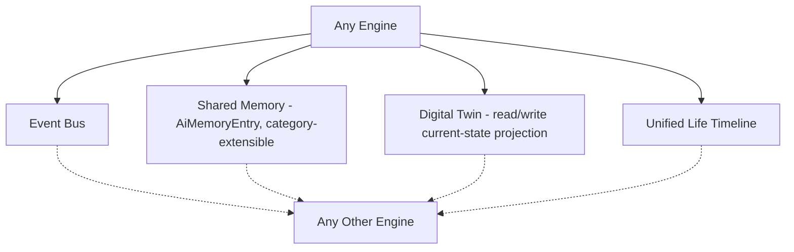
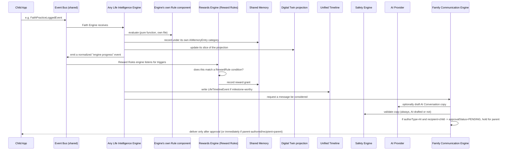

# Architecture 1.0 — Ebni AI Platform (Digital Safety + Life Intelligence Platform)

**Status: OFFICIAL REFERENCE. Supersedes
`SPRINT12_FAMILY_GROWTH_ARCHITECTURE_REVIEW.md` and
`LIFE_INTELLIGENCE_PLATFORM_ARCHITECTURE_V2.md` in full — this document
is now the single source of truth for the Life Intelligence Platform's
shape.** Still zero code, zero migration, zero interface written.
Implementation begins only after this is approved, and only
incrementally, per the standing rule: **nothing in `ai-core/`, or any
other already-shipped module, is touched.**

---

## 1. The Governing Principle (Decision 12)

No engine is an island. Every engine — Digital Safety's 7 and Life
Intelligence's 10 — connects to every other engine through exactly
four shared integration points, never directly to each other:



An engine never calls another engine's service class directly. It
emits an event, reads/writes shared memory under its own category,
reads/writes its slice of the Digital Twin projection, and writes to
the Timeline when something is milestone-worthy. This is what makes
this "one platform," not ten disconnected features — and it's also
exactly the shape `ai-core`'s 7 engines already use with each other
today, extended rather than reinvented.

## 2. The Future-Engine Contract (Decision 11)

Any engine added after this document — in this project or by a future
team — MUST implement all five of the following before it ships:

| Contract | What it means concretely |
|---|---|
| Memory | Reads/writes `AiMemoryEntry` under its own `category` string — never a new ad-hoc key-value store |
| Events | Emits typed events on the existing `EventBus` (backend) / Dart `EventBus` (Child App) — never a new pub/sub mechanism |
| AI Provider | Any LLM phrasing goes through the existing `IAIProvider` port — never a direct provider SDK import |
| Audit | Anything compliance-relevant writes to the existing `AuditLog` — never a parallel audit table |
| Safety Validation | Any parent- or child-facing copy passes through `SafetyEngineService.validate()` before delivery — never bypassed |

This turns "reuse the pattern, not the class" (the founding decision of
this whole effort) from a one-time design choice into a standing rule
future engines are checked against.

---

## 3. The Two-Domain Map (Final)

```mermaid
graph TD
    AP[AI Platform]
    AP --> DS[Digital Safety Domain - unchanged, zero files touched]
    AP --> LIP[Life Intelligence Platform]
    AP --> PROV[AI Provider - shared]

    DS --> DS1[Rule Engine]
    DS --> DS2[Decision Engine]
    DS --> DS3[Behavioral Engine]
    DS --> DS4[Recommendation Engine]
    DS --> DS5[Safety Engine]
    DS --> DS6[Memory Engine]
    DS --> DS7[Knowledge Engine]

    LIP --> C[Coaching Engine - Parent/Child/Family tracks]
    LIP --> F[Faith Engine]
    LIP --> H[Health Engine - Nutrition+Hydration+Sleep+Activity+optional measurements]
    LIP --> HB[Habit Builder]
    LIP --> LE[Learning and Education Engine]
    LIP --> ST[Smart Tasks Engine - AI-generated dynamic tasks]
    LIP --> R[Rewards Engine - Family Economy + Reward Rules]
    LIP --> FC[Family Communication Engine - incl. AI Conversation]
    LIP --> FI[Family Insight Engine]
    LIP --> DT[Digital Twin - projection]
    LIP --> TL[Unified Life Timeline]
```



**10 engines + 1 projection**, down from an earlier draft's separate
Nutrition/Hydration/Activity (now one Health Engine) and separate
Faith-inside-Learning (now independent) — net simpler, not more sprawling.

---

## 4. What Changed From v2, Engine by Engine

| Engine | v2 shape | Architecture 1.0 shape |
|---|---|---|
| Parenting Coach | Single track | **Coaching Engine** — Parent / Child / Family tracks, one engine, three strategies |
| Nutrition + Hydration + Activity | 3 separate engines | **Health Engine** — one engine, absorbs all three, adds Sleep (new) and optional Weight/Height (new, explicitly optional) |
| Learning & Education | Included Quran memorization/review | **Quran moved out entirely** to the new independent Faith Engine; Learning & Education keeps school, languages, reading, homework, courses, tests |
| — | Faith was a Digital Twin sub-score derived from Habit Builder + Learning | **Faith Engine** — independent, own tables, own tracked practices |
| Habit Builder | Static, parent-defined only | Unchanged in shape, but now explicitly the STATIC habit list; dynamic AI-suggested tasks live in the new Smart Tasks Engine instead |
| — | — | **Smart Tasks Engine (NEW)** — AI-generated, context-driven, dynamic, distinct from static Habits |
| Rewards Engine | Family economy (store, ledger, badges) | Unchanged, PLUS **Reward Rules** — automatic, rule-based triggers (not manual-only) |
| Family Communication Engine | Parent/child/broadcast delivery | Unchanged, PLUS **AI Conversation** — AI-drafted messages, mandatory parent approval before any child-facing delivery |
| Digital Twin | Multi-score view | Unchanged as a view, PLUS explicitly a **live current-state projection** other engines read directly (not recomputed per read) |
| Life Timeline | Already unified in v2 | Confirmed unchanged — this requirement was already satisfied |
| Social Score | Flagged as an undefined gap | **Resolved** — defined data sources only, zero surveillance (§6) |
| Growth Score | Flagged as ambiguous | **Resolved** — it IS the composite/overall score, not physical growth (§6) |

---

## 5. Database Changes (Still 100% Additive)

Every table below is new. Zero existing table (`Child`, `Family`,
`User`, `Device`, `ScreenTimePolicy`, `Notification`, `AiMemoryEntry`'s
schema) is touched.

### Health Engine (merges what were 3 separate table groups)
- `NutritionLog`, `HydrationLog`, `ActivityLog` — unchanged shapes from
  earlier drafts, now grouped under one service rather than three
- `ActivityLog` gets one new field vs. earlier drafts:
  `socialContext: SOLO | GROUP | TEAM` — the concrete data source
  Social Score needs for "group sports activities" (§6), not a new table
- `SleepLog` (NEW) — `childId`, `date`, `sleepStart`, `sleepEnd`, `quality?`
- `PhysicalMeasurementLog` (NEW, explicitly optional feature) —
  `childId`, `date`, `heightCm?`, `weightKg?`. **Deliberately NOT named
  anything containing "Growth"** — that word is reserved for the AI
  composite score (§6.2) and reusing it here would recreate the exact
  ambiguity Decision 2 just resolved
- `HealthScoreDaily` (replaces the earlier separate Nutrition/Activity
  score tables) — one daily score row per child, breakdown JSON keyed
  by sub-component (nutrition/hydration/sleep/activity)

### Faith Engine (NEW module, was folded into Learning in v2)
- `FaithPractice` — definition table: `type` (quran_memorization \|
  quran_review \| azkar \| salah \| islamic_value \| occasion),
  `title`, `config: Json` (e.g. which surah, which azkar set)
- `FaithPracticeLog` — `childId`, `practiceId`, `date`,
  `status/progress`, mirrors `HabitCompletion`'s shape

### Learning & Education (narrowed scope from v2)
- `LearningGoal`, `LearningSession`, `LearningAssessment` — unchanged
  from v2, Quran fields removed (now Faith Engine's)

### Habit Builder — unchanged from v2 (`Habit`, `HabitCompletion`)

### Smart Tasks Engine (NEW)
- `SmartTask` — `childId`, `title`, `category`, `generatedReason`
  (the reasoning path, same explainability discipline as
  `IExplainableDecision`), `sourceSignals: Json` (which engines'
  data triggered this suggestion), `suggestedDate`, `status:
  SUGGESTED | ACCEPTED | COMPLETED | DISMISSED`

### Rewards Engine (adds Reward Rules to v2's tables)
- `RewardsAccount`, `RewardsLedgerEntry`, `BadgeDefinition`,
  `ChildBadgeAward`, `RewardCatalogItem`, `RewardRedemption` —
  unchanged from v2
- `RewardRule` (NEW) — `familyId?` (null = a built-in default rule,
  set = a family-specific override), `triggerEngine`,
  `triggerCondition: Json` (e.g. `{"practiceType": "salah",
  "streakDays": 7}`), `rewardType: XP | COINS | BADGE`,
  `rewardAmountOrBadgeId`. Evaluated by a new small Rule component in
  `rewards-engine.service.ts` — same pure-function evaluation
  discipline as `RuleEngineService`, new file, not a shared class

### Family Communication Engine (adds AI Conversation + approval to v2)
- `ChildMessage` — same as v2, PLUS: `authorType: PARENT | AI`,
  `approvalStatus: NOT_REQUIRED | PENDING | APPROVED | REJECTED`
  (`NOT_REQUIRED` when a parent authored it directly; `PENDING` only
  applies to AI-drafted content, enforcing Decision 8's "parent stays
  the final decision-maker" requirement at the schema level, not just
  in a service-layer `if` statement that could be forgotten)
- `FamilyBroadcastMessage` — unchanged from v2

### Social Score data source (Decision 1) — no new dedicated table
Computed entirely from EXISTING-in-this-design tables:
`HabitCompletion` (family/shared task commitment),
`ActivityLog.socialContext = GROUP|TEAM`, `ChildBadgeAward` filtered
to badges tagged `isGroupAchievement: true` (one new boolean column on
`BadgeDefinition`), and the new small pair below:
- `FamilyChallenge` (NEW) — `familyId`, `title`, `startDate`,
  `endDate`, `criteria: Json`
- `FamilyChallengeParticipation` (NEW) — `challengeId`, `childId`,
  `completedAt?`

### Unified Timeline — unchanged from v2
- `LifeTimelineEvent` — `childId`, `sourceEngine`, `category`
  (`HEALTH | LEARNING | FAITH | REWARDS | SAFETY | HABITS | FAMILY` —
  Decision 10's exact category list), `eventType`, `title`,
  `occurredAt`, `metadata: Json`

---

## 6. Digital Twin — Final Definition

### 6.1 Still a projection, now explicitly a live-read surface (Decision 9)

Every Life Intelligence engine, when it writes new data, ALSO updates
its own slice of a lightweight per-child projection row (one row per
child, one JSON column per engine's contribution — e.g.
`healthSlice`, `learningSlice`, `faithSlice`) so any engine that needs
"what's this child's current state" reads ONE row instead of
re-querying six tables. **This projection is rebuildable from the
source tables at any time** — it is a cache with a defined
regeneration path, not a second source of truth. If it and the source
tables ever disagree, the source tables win, always.

### 6.2 Sub-scores and the Growth Score (Decisions 1 & 2, resolved)

| Sub-score | Computed from | Status |
|---|---|---|
| Safety Score | Existing `DeviceRiskAssessment`/Trust history | Direct reuse, unchanged |
| Health Score | Health Engine's `HealthScoreDaily` | New, computable |
| Learning Score | Learning & Education Engine | New, computable |
| Faith Score | Faith Engine's `FaithPracticeLog` | Independent engine now, not derived secondhand |
| Behavior Score | `BehavioralIntelligenceEngineService`'s trend pattern, reimplemented for LIP + Digital Safety data | New, computable |
| Habits Score | Habit Builder's `HabitCompletion` rate, kept distinct from Behavior Score (general conduct trend) per Decision 2's explicit listing of both | New, computable |
| **Social Score** | `HabitCompletion` (shared/family tasks) + `ActivityLog.socialContext` + `FamilyChallengeParticipation` + group `ChildBadgeAward` count + (future) school integration | **Resolved — zero surveillance, zero conversation/contact data, every input already exists somewhere in this design** |
| **Growth Score** | Weighted composite of ALL the above (Safety, Health, Learning, Faith, Behavior, Habits, Social) | **Resolved — this IS the "Overall Score," not physical growth. `PhysicalMeasurementLog` (§5) is a completely separate, optional, literal height/weight log with no naming or conceptual overlap** |

Every sub-score and the Growth Score itself remain
`IExplainableDecision`-shaped (inputs, confidence, reasoning path) —
the UI always shows contributing factors, never a bare number, per the
standing "not a ranking tool" instruction.

---

## 7. Event Flow (Final)



---

## 8. API Boundaries (Final, under `/api/v1/life-intelligence/*`)

```
# Health (replaces separate nutrition/hydration/activity prefixes)
POST   /life-intelligence/health/nutrition-logs
POST   /life-intelligence/health/hydration-logs
POST   /life-intelligence/health/sleep-logs
POST   /life-intelligence/health/activity-logs
POST   /life-intelligence/health/measurements        (optional feature)
GET    /life-intelligence/health/score/:childId

# Faith
POST   /life-intelligence/faith/practices/:id/log
GET    /life-intelligence/faith/progress/:childId

# Learning
POST   /life-intelligence/learning/goals
POST   /life-intelligence/learning/sessions
GET    /life-intelligence/learning/progress/:childId

# Habits (static) vs Smart Tasks (dynamic) — separate prefixes, deliberately not merged
GET    /life-intelligence/habits/:childId
POST   /life-intelligence/habits/:id/complete
GET    /life-intelligence/smart-tasks/:childId
POST   /life-intelligence/smart-tasks/:id/accept
POST   /life-intelligence/smart-tasks/:id/dismiss

# Rewards
GET    /life-intelligence/rewards/store/:familyId
POST   /life-intelligence/rewards/redemptions/:id/approve
POST   /life-intelligence/rewards/rules              (parent-defined overrides only; built-ins are seeded)

# Family Communication
POST   /life-intelligence/communication/broadcast
POST   /life-intelligence/communication/ai-draft      (returns a draft, does NOT send)
POST   /life-intelligence/communication/:id/approve    (parent approves an AI draft before delivery)
GET    /life-intelligence/communication/child/:childId

# Digital Twin & Timeline
GET    /life-intelligence/digital-twin/:childId
GET    /life-intelligence/timeline/:childId?category=
```

Zero existing route touched.

---

## 9. Coaching Engine — Track Detail (Decision 5)

One service, `coaching-engine.service.ts`, three strategy modes sharing
the same underlying Decision/Memory/Safety plumbing:

- **Parent Coach**: what this project's earlier drafts called
  "Parenting Coach" — daily/weekly guidance for the parent.
- **Child Coach**: age-appropriate, encouraging guidance surfaced
  through the Child App's `ChildMessage` channel (always
  parent-reviewable per §5's `approvalStatus`, since this is
  inherently AI-authored, child-facing content).
- **Family Coach**: guidance addressed to the family unit as a whole
  (e.g., "this week's shared challenge idea"), delivered via
  `FamilyBroadcastMessage`.

---

## 10. Honest Gaps Still Standing (Nothing Silently Resolved)

- School-goal / grade tracking still needs either manual entry (in
  scope) or a real LMS/SIS integration (explicitly out of scope).
- `PhysicalMeasurementLog` is explicitly optional — whether it ships
  in the first Health Engine increment or later is an implementation
  sequencing decision, not an architecture question, and is left open.
- Smart Tasks Engine's suggestion QUALITY (are the AI's suggested
  tasks actually good?) is a product-tuning concern that can only be
  evaluated once real usage data exists — this document specifies the
  mechanism, not the prompt/heuristic quality bar.

---

## 11. What Happens Next

This document is the reference. Implementation proceeds
**incrementally**, module by module, starting wherever the team decides
gives the fastest real signal (this document does not sequence that —
a separate delivery-planning decision). Every increment still
individually satisfies §2's five-part contract before it's considered
done, and every increment is additive — `ai-core/` and every other
previously-shipped module remains untouched throughout.
