# Event Pipeline — the Domain Event Bus, the Outbox, and `POST /v1/events/batch`

| Document ID | Version | Owner Role | Status | Last Updated |
|---|---|---|---|---|
| ARCH-EVENT-PIPELINE | 1.0 | Backend Architecture | Implemented (Sprint F3, risk R3) | 2026-08-14 |

This is the contract. It is not a proposal: every statement below is implemented
in `apps/backend/src/modules/events` and `apps/backend/src/shared/events`, and
executed by `apps/backend/test/events`.

---

## 1. The rule

> **No new domain module may write child-achievement state without emitting a
> domain event through this bus, inside the same transaction as the write.**

Two mechanisms enforce it:

1. `OutboxWriter.writeWithin(tx, draft)` takes the **caller's** transaction. It
   does not open its own, and it must not — opening its own would put the event
   outside the caller's transaction, which is the exact bug the pattern exists
   to prevent.
2. `npm run ci:event-emission` (`scripts/ci/assert-event-emission.ts`), wired
   into `.github/workflows/ci.yml` as a blocking step. Read §8 for exactly what
   that check does and does not prove.

---

## 2. The canonical chain

```
Child device (local computation, EDGE-FIRST)
  -> POST /api/v1/events/batch          device-bound JWT; tenant from the TOKEN
  -> one transaction per event:
       domain row  +  domain_events row  +  outbox_messages row   (all or none)
  -> OutboxRelay (poller, FOR UPDATE SKIP LOCKED)
  -> InProcessEventBus                  typed publish/subscribe
  -> RewardsCompletionConsumer          RewardsEngineService.processTriggerEvent
       |- granted === 0  =>  STOP. No event, no notification, nothing.
       |- granted  >  0  =>  emit REWARD_GRANTED through the Outbox
  -> NotificationRewardConsumer         SmartNotificationIntegrationService
       cooldown -> duplicate -> quiet hours -> daily max -> category max -> priority
  -> notification row / FCM
```

`REWARD_GRANTED` has exactly one producer in the entire codebase: the
`if (granted > 0)` branch of `RewardsCompletionConsumer`. "No grant ⇒ no
notification" is therefore a property of the **wiring**, not a runtime check
someone can forget — there is no code path from a duplicate completion to the
notification consumer at all.

---

## 3. The envelope

`src/shared/events/event-envelope.ts`. Two types, deliberately:

`WireEventEnvelope` — what a device may send. **It contains no tenant identity
of any kind.**

| field | type | notes |
|---|---|---|
| `clientEventId` | string | `{deviceId-short}:seq:{n}` — the device's own queue key |
| `type` | string | validated per item, not by `@IsEnum` (forward compatibility) |
| `occurredAt` | ISO-8601 | device clock; skew-checked |
| `schemaVersion` | int? | server accepts `SUPPORTED_SCHEMA_VERSIONS` |
| `timezone` / `localDate` | string? | `localDate` falls back to the UTC date |
| `priority`, `agentVersion` | string? | |
| `payload` | object | shape depends on `type` |

`DomainEventEnvelope` — what exists after the server has stamped it.

| field | source |
|---|---|
| `id` | server UUID; equals `domain_events.id` |
| `type`, `schemaVersion` | validated from the wire |
| `familyId` | **verified device token → device row.** Never the body |
| `childId`, `deviceId` | server-derived from the same device row |
| `aggregateType` / `aggregateId` | per-type spec |
| `occurredAt` | device clock |
| `receivedAt` | **server clock, authoritative** |
| `idempotencyKey` | **server-composed, deterministic** (§5) |
| `clientEventId` | echoed for transport de-duplication |
| `traceId` | the request's correlation id, propagated to every consumer |
| `payload` | server-normalised; client-sent `childId`/`deviceId`/`idempotencyKey` are **overwritten, not merged** |

---

## 4. The catalogue

`src/shared/events/event-types.ts` is the single source of truth, and the Prisma
`enum EventType` is asserted to be the same list by
`test/events/event-bus.spec.ts`.

| event | producer | consumers | device may send? | completion? |
|---|---|---|---|---|
| `HABIT_COMPLETED` | Habits (device/app) | Rewards, Streaks | ✅ | ✅ |
| `TASK_COMPLETED` | Tasks | Rewards | ✅ | ✅ |
| `DAILY_GOAL_COMPLETED` | Habits/Tasks | Rewards | ✅ | ✅ |
| `HYDRATION_GOAL_COMPLETED` | Health | Rewards | ✅ | ✅ |
| `ACTIVITY_GOAL_COMPLETED` | Health | Rewards | ✅ | ✅ |
| `EDUCATION_PROGRESS` | Education/Faith (one engine) | Rewards | ✅ | ✅ |
| `MEMORIZATION_COMPLETED` | Education/Faith | Rewards | ✅ | ✅ |
| `STREAK_ACHIEVED` | **StreakDetectionConsumer (derived)** | Rewards | ❌ | ✅ |
| `REWARD_GRANTED` | **RewardsCompletionConsumer (derived)** | Notifications | ❌ | ❌ |
| `DEVICE_PAIRED` | Pairing | *(none yet)* | ❌ | ❌ |
| `SCREEN_TIME_THRESHOLD` | DigitalWellbeing | *(none yet — recorded only)* | ✅ | ❌ |
| `IMPORTANT_SAFETY_EVENT` | Devices/Agent | *(none yet — recorded only)* | ✅ | ❌ |

`TASK_COMPLETED` and `MEMORIZATION_COMPLETED` are additions to CONTEXT §5's ten,
required by CONTEXT §4: Tasks and Faith/Education must flow through the **same**
completion path as Habits rather than getting their own engine.

**Why `REWARD_GRANTED` and `STREAK_ACHIEVED` are not device-ingestible:** a
device that could post `REWARD_GRANTED` could manufacture a notification for a
reward that never happened. That is asserted, not assumed
(`test/events/event-bus.spec.ts`, and over HTTP in the e2e suite as
`EVENT_TYPE_NOT_DEVICE_INGESTIBLE`).

### The one completion path

`RewardsCompletionConsumer` subscribes to **all eight** completion types with the
**same handler**. There is no `switch (source)`. The only thing it reads to
decide which Reward Rules apply is `payload.completionKind`, used as a table
lookup (`COMPLETION_KIND_TO_REWARD_ENGINE`). Adding a fifth producer is one line
in that map and zero lines in the consumer.

---

## 5. Idempotency-key composition

`src/shared/events/idempotency.ts`. Two rules, both load-bearing:

1. **Deterministic, never random.** The device regenerates the same key after a
   reboot, so a queued-but-unacknowledged event replayed tomorrow collides with
   yesterday's row instead of granting a second reward.
2. **The defence is the database, not the code.** `domain_events (family_id,
   idempotency_key)` and `rewards_ledger_entries (child_id, idempotency_key)` are
   what make the grant happen once. A2 §7.3 measured what a code-level
   "does it already exist?" check does under 8 concurrent identical requests: it
   grants 8 rewards.

The key is composed **server-side** from server-known values. A device cannot
choose its own key, because a device that could choose it could choose a fresh
one per retry and mint unlimited rewards.

| event | key |
|---|---|
| `HABIT_COMPLETED` | `child:{c}:habit:{habitId}:{localDate}` |
| `TASK_COMPLETED` | `child:{c}:task:{sourceId}` |
| `STREAK_ACHIEVED` | `child:{c}:streak:{type}:{length}` |
| `DAILY_GOAL_COMPLETED` | `child:{c}:dailygoal:{goalType}:{localDate}` |
| `HYDRATION_GOAL_COMPLETED` | `child:{c}:hydration:{localDate}` |
| `ACTIVITY_GOAL_COMPLETED` | `child:{c}:activity:{localDate}` |
| `EDUCATION_PROGRESS` | `child:{c}:edu:{goalId}:{milestone}` |
| `MEMORIZATION_COMPLETED` | `child:{c}:memorization:{progressId}` |
| `REWARD_GRANTED` | `granted:{originating event's key}` |
| `SCREEN_TIME_THRESHOLD` | `child:{c}:threshold:{percent}:{localDate}` |
| `DEVICE_PAIRED` | `device:{d}:paired` |
| `IMPORTANT_SAFETY_EVENT` | `device:{d}:safety:{kind}:{hourBucket}` |

`{c}` / `{d}` are the first 12 hex characters of the uuid, so every key fits the
`VARCHAR(80)` column. Every catalogued type is asserted to produce a distinct key
from identical inputs — no cross-type collision.

---

## 6. The outbox lifecycle

```mermaid
stateDiagram-v2
    [*] --> PENDING : written in the SAME tx as the domain row
    PENDING --> PUBLISHING : claim (FOR UPDATE SKIP LOCKED, attempt_count += 1)
    FAILED --> PUBLISHING : claim, once next_attempt_at <= now()
    PUBLISHING --> PUBLISHED : every registered handler acked
    PUBLISHING --> FAILED : a handler threw, attempt_count < 8
    PUBLISHING --> DEAD : a handler threw, attempt_count >= 8
    PUBLISHING --> FAILED : stale-lock sweep (locked_at older than 120s)
    PUBLISHED --> [*]
    DEAD --> [*] : never retried; needs a human
```



| property | value | where |
|---|---|---|
| poll interval | 2 s | `OUTBOX_RELAY_DEFAULTS.pollIntervalMs` |
| batch size | 200 | `OUTBOX_RELAY_DEFAULTS.batchSize` |
| max attempts | 8 → `DEAD` | `OUTBOX_RELAY_DEFAULTS.maxAttempts` |
| backoff | `LEAST(2 ^ attempt_count, 300)` seconds — 2s, 4s, 8s … capped at 5m | computed in SQL |
| stale lock | 120 s | `staleLockSeconds` |
| enqueue uniqueness | `outbox_messages (domain_event_id, destination)` | migration 0005 |

`attempt_count` increments at **claim** time, not at failure time, so a worker
that crashes mid-delivery still burns an attempt and a message that reliably
kills its worker reaches `DEAD` instead of looping forever.

### Delivery guarantees, plainly

- **At-least-once.** A crash after `publish()` and before `MARK_PUBLISHED`
  redelivers. Every consumer must be idempotent.
- **Not exactly-once.** Nothing here claims it.
- **No global ordering.** Two events for the same child can be delivered out of
  order (multiple relays, `SKIP LOCKED`). Every consumer is therefore
  commutative or idempotent: Rewards is keyed on `idempotencyKey`, Notifications
  on type + a 5-minute duplicate window, Streaks recomputes from the completion
  rows rather than incrementing a counter.
- **At-most-once enqueue** per `(event, destination)`, by unique index.
- **Handlers for one event run sequentially, in registration order.** That is a
  guarantee consumers may rely on.

### Tenancy inside a background worker

The **claim** and the **status write** are cross-tenant and run under
`runAsSystem('OUTBOX_RELAY', ...)`, which logs the bypass and its justification
every time. The **dispatch** is not: before a single consumer runs, the relay
re-enters `runWithTenant({ familyId: message.familyId })`, so Rewards,
Notifications and Streaks execute under the ordinary Prisma extension with
deny-by-default intact. A consumer cannot read another family's rows even though
the loop that woke it could.

> **Hazard, written down because it caused a real outage in development:** a
> `PrismaPromise` is **lazy** — it executes when `.then` is attached, not when it
> is constructed. `runAsSystemAsync(reason, why, () => prisma.x.findUnique(...))`
> therefore builds the query inside the `AsyncLocalStorage` scope and resolves it
> **outside** it, the extension sees no context, and every dispatch throws
> `TENANT_CONTEXT_MISSING`. Under deny-by-default that is not a leak, it is a
> total relay outage. `OutboxRelay.runInSystemScope()` exists solely to `await`
> inside the scope; use it for every cross-tenant call in that file.

---

## 7. `POST /api/v1/events/batch`

Device-authenticated (`DeviceJwtAuthGuard`, a different Passport strategy from
the parent one: a stolen parent token cannot post events and a stolen device
token cannot reach parent endpoints). The tenant is derived from the token and
re-checked against the device row, so a **revoked** device with an unexpired,
perfectly valid JWT is rejected with 403.

| bound | value | failure |
|---|---|---|
| batch size | 200 | 413 `EVENT_BATCH_TOO_LARGE` (whole batch) |
| device clock skew | ±10 min | 400 `DEVICE_CLOCK_SKEW` (whole batch) |
| event age (past) | 48 h | per-item `EVENT_CLOCK_SKEW` |
| event age (future) | 5 min | per-item `EVENT_CLOCK_SKEW` |
| rate limit | 12 batches/hour, **keyed by `deviceId`** | 429 |
| batch replay | `Idempotency-Key` header, 24 h in Redis | identical response replayed |

The rate limit is device-keyed, not IP-keyed, because docs/06 §9.2 records that
Egyptian mobile networks use CGNAT heavily — an IP-keyed limit here would
throttle a neighbour's child.

### Replay protection, three layers

1. `domain_events (family_id, idempotency_key)` — the final guarantee.
2. `domain_events (family_id, device_id, client_event_id)` — transport-level
   de-duplication of a re-sent row.
3. `Idempotency-Key` in Redis — saves a round trip. A **cache**, not the
   guarantee: with Redis down every event still lands on layer 1 and comes back
   as `DUPLICATE`.

### Partial success — the pruning contract

The endpoint answers **200 with per-item results**, never 207 (207 is WebDAV and
Dart/Kotlin HTTP clients handle it badly). One corrupt event does not take down
199 valid ones: **one transaction per event**.

| status | what the device must do |
|---|---|
| `ACCEPTED` | delete from the local queue |
| `DUPLICATE` | delete from the local queue — **not an error**, it is the acknowledgement you needed after a timeout |
| `REJECTED` | dead-letter if `errorCode` is in `PERMANENT_REJECTION_CODES`, retry otherwise |
| absent from `results[]` | **keep it.** Always the safe assumption |

**Request** — this exact exchange is produced by
`test/events/event-pipeline.e2e.spec.ts` ("rejects one bad event without taking
down its valid siblings"); the response below is copied verbatim from that run,
not composed by hand.

```http
POST /api/v1/events/batch
Authorization: Bearer <device access token>
Content-Type: application/json

{
  "deviceTime": "2026-08-13T12:00:00.000Z",
  "events": [
    { "clientEventId": "mixed:unknown",
      "type": "NOT_A_REAL_EVENT",
      "occurredAt": "2026-08-13T12:00:00.000Z",
      "payload": {} },
    { "clientEventId": "mixed:derived",
      "type": "REWARD_GRANTED",
      "occurredAt": "2026-08-13T12:00:00.000Z",
      "payload": {} },
    { "clientEventId": "mixed:badpayload",
      "type": "HABIT_COMPLETED",
      "occurredAt": "2026-08-13T12:00:00.000Z",
      "payload": { "habitId": "not-a-uuid" } },
    { "clientEventId": "mixed:good",
      "type": "HABIT_COMPLETED",
      "occurredAt": "2026-08-13T12:00:00.000Z",
      "localDate": "2026-01-05",
      "payload": { "habitId": "a244d906-d446-4bfc-b0b0-627972b8b85f" } }
  ]
}
```

**Response — `200 OK`** (captured)

```json
{
  "data": {
    "accepted": 1,
    "duplicates": 0,
    "rejected": 3,
    "serverTime": "2026-08-13T12:00:00.000Z",
    "results": [
      { "clientEventId": "mixed:unknown", "status": "REJECTED",
        "errorCode": "EVENT_UNKNOWN_TYPE",
        "messageAr": "نوع الحدث غير معروف لهذا الإصدار من الخادم." },
      { "clientEventId": "mixed:derived", "status": "REJECTED",
        "errorCode": "EVENT_TYPE_NOT_DEVICE_INGESTIBLE",
        "messageAr": "هذا النوع من الأحداث لا يُقبل من الجهاز." },
      { "clientEventId": "mixed:badpayload", "status": "REJECTED",
        "errorCode": "EVENT_PAYLOAD_INVALID",
        "messageAr": "حمولة الحدث غير مكتملة أو غير صالحة." },
      { "clientEventId": "mixed:good", "status": "ACCEPTED",
        "eventId": "34afd758-c1b2-4a6c-972d-8891730b35aa" }
    ]
  },
  "meta": { "requestId": "d6a203ba-64ab-4aca-a43c-323c53129fa9" }
}
```

Note the `serverTime`: the suite runs under a deliberately fixed clock (see the
file header), which is why it is a round number. In production it is
`new Date()` at ingestion.

`serverTime` is authoritative: a device with drift corrects itself from it.

---

## 8. The consumer contract

A consumer:

1. registers in `onModuleInit` via `EVENT_SUBSCRIBER` — never by importing the
   concrete bus (asserted by a test that walks `src/`);
2. **must be idempotent**, because delivery is at-least-once;
3. may throw. A throw means "retry this message"; it does not stop the other
   consumers of the same event and it never blocks the queue for anyone else;
4. must treat a *decision* as success. `notifyEvent` returning `DEFER` (quiet
   hours) or `SUPPRESS` (fatigue) is a handled outcome — treating it as a
   delivery failure would retry it eight times and dead-letter a correct
   decision;
5. gets the tenant context for free: it already runs inside
   `runWithTenant(message.familyId)`.

`ConsumedMessage (consumer_name, domain_event_id)` is a **fast path**, not the
guarantee. The order is *run the work, then mark*, so a crash between the two
replays the work — deliberately, because the alternative order turns a crash into
silently lost work. The correctness argument is the unique constraint inside each
consumer's own write. `test/events/event-pipeline.e2e.spec.ts` deletes the
markers before forcing a redelivery precisely so they cannot be what makes the
"no duplicate side effect" assertion pass.

---

## 9. The CI ratchet, and what it does not prove

`npm run ci:event-emission`:

- **RULE E1** — a file writing a domain-state model must import `OutboxWriter`
  or be listed in `KNOWN_UNWIRED` with a written reason (≥ 40 chars).
- **RULE E2** — `domain_events` / `outbox_messages` / `consumed_messages` may be
  written only from `src/modules/events`.
- **RULE E3** — no dead entries: allowlisted files must still exist and still
  write; every configured model must still exist in `schema.prisma`.

**It cannot prove that a write and its event share a transaction.** That is a
data-flow property across a `$transaction` callback and across
repository/service/consumer layers; deciding it statically needs a type-aware
call graph, and a regex-shaped approximation would be *worse than nothing* — it
would pass a service that emits the event **outside** the transaction (the exact
bug the pattern exists to prevent) while failing honest code. So it is not
attempted, and this section exists so nobody later assumes it was. The
single-transaction property is enforced by the **shape of the API**
(`writeWithin(tx, …)` takes the caller's transaction and cannot open its own)
and proven by execution, not by a static check.

`KNOWN_UNWIRED` is the enumerated, reviewable answer to "what is still not wired
through the bus". It is reproduced in `F3-Event-Pipeline-Report.md` §9.

---

## 10. Swapping the transport

`InProcessEventBus` is named in exactly two places, both behind a token, both in
`events.module.ts`. Moving to Redis Streams or SQS is:

1. write `infrastructure/redis-streams-event-bus.ts` implementing
   `IEventPublisher` + `IEventSubscriber`;
2. change the two `useClass`/`useExisting` lines.

Nothing else in the codebase names the implementation — verified by a test, not
asserted in a comment. **The outbox does not change at all**: it is already the
durable hand-off, which is the property that makes the swap cheap.

There is deliberately no BullMQ. The outbox table **is** the durable queue
(docs/04 ADR-007). Putting BullMQ in front of it would mean two queues, two retry
policies, and two places a message can be stuck.
