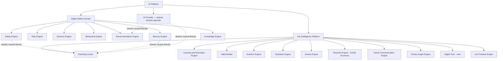
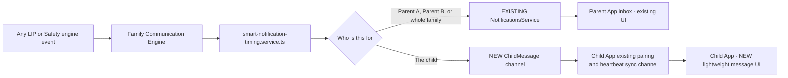
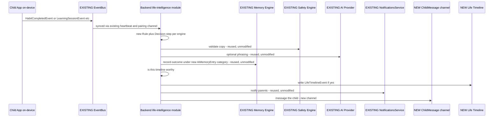

# Life Intelligence Platform — Final Architecture (v2, for last review)

**Status: FINAL REVIEW VERSION. Still zero code, zero migration, zero
interface written — per explicit instruction.** This supersedes
`SPRINT12_FAMILY_GROWTH_ARCHITECTURE_REVIEW.md`'s naming and scope;
its §0/§1/§2 findings (reuse-the-pattern-not-the-class) are unchanged
and carried forward without re-litigating them.

Two new real findings from this pass, grounded in the actual schema:

- **`Notification.userId` is singular and required — a notification
  is always addressed to exactly one `User`.** "Message to Father" or
  "message to Mother" needs zero new field (they're just different
  `User` rows in the same family) — but **"message to the Child" is a
  genuine gap**: `Child` has no login, no session, no auth concept
  anywhere in this schema. A child-facing message cannot reuse the
  `Notification` model's delivery assumption and needs its own
  channel (§6.4).
- **`FamilyRole` is only `OWNER | PARENT`** — no structural
  "mother/father" distinction exists; targeting a specific parent is
  just targeting their `userId`, already fully supported.

---

## 1. The Two-Domain Split



**Digital Safety** keeps its 7 engines exactly as they are today — zero
files touched. **Life Intelligence Platform (LIP)** is the new sibling
domain, 10 engines + the Digital Twin view. Both sit under the same
`AI Platform` umbrella and share only what's genuinely domain-agnostic:
the Safety Engine (copy validation), the Memory Engine (generic
key-value + recommendation history), and the AI Provider (phrasing).

---

## 2. Backend Module Rename

```
apps/backend/src/modules/
  ai-core/            <- UNCHANGED, zero files touched (Digital Safety's 7 engines)
  life-intelligence/  <- NEW (was "family-growth" in the prior draft — renamed per this review)
    domain/
    application/services/
    infrastructure/
    presentation/controllers/
```

Every sub-engine gets its own service file under
`life-intelligence/application/services/`, named directly after the
engine (`learning-education.service.ts`,
`family-communication.service.ts`, `life-timeline.service.ts`, etc.) —
same one-service-per-bounded-concern discipline `ai-core` already models.

---

## 3. The 10 Engines + Digital Twin View — What Changed From v1

| Engine | Status vs. v1 draft |
|---|---|
| Parenting Coach | Unchanged |
| **Learning & Education Engine** | **NEW — split out from Habit Builder**, its own engine (§5.2) |
| Habit Builder | Unchanged, but now excludes study/Quran/school tasks (moved to Learning & Education) — keeps prayer, azkar, chores, water, teeth, room-tidying, exercise-as-a-habit-checkbox |
| Nutrition Engine | Unchanged |
| Hydration Engine | Unchanged |
| Activity Engine | Unchanged |
| **Rewards Engine** | **Expanded — full family economy** (§5.7) |
| **Family Communication Engine** | **Expanded from "Smart Notification"** (§5.8) |
| Family Insight Engine | Unchanged |
| **Digital Twin** | **Expanded — multi-score, explainable** (§5.10) |
| **Life Timeline Engine** | **NEW** (§5.11) |

---

## 4. Database Changes (Still 100% Additive — Zero Existing Table Touched)

All tables below are new. None modify `Child`, `Family`, `User`,
`Device`, `ScreenTimePolicy`, `Notification`, or `AiMemoryEntry`'s schema.

| Table | Engine | Notes |
|---|---|---|
| `NutritionLog`, `NutritionScoreDaily` | Nutrition | Unchanged from v1 |
| `HydrationLog` | Hydration | Unchanged from v1 |
| `ActivityLog`, `ActivityScoreDaily` | Activity | Unchanged from v1 |
| `Habit`, `HabitCompletion` | Habit Builder | Unchanged from v1, scope narrowed (§3) |
| `LearningGoal` | Learning & Education | `childId`, `subject/track` (school \| quran-memorization \| quran-review \| language \| reading \| custom), `targetDate`, `status` |
| `LearningSession` | Learning & Education | Per-session log: duration, subject, `progressNote`, optional `assessmentScore` |
| `LearningAssessment` | Learning & Education | Test/quiz results, source (`self-reported` \| `school-linked` — the latter explicitly NOT built this phase, flagged §7) |
| `RewardsAccount` | Rewards | Unchanged from v1 |
| `RewardsLedgerEntry` | Rewards | Unchanged from v1 |
| `BadgeDefinition`, `ChildBadgeAward` | Rewards | Unchanged from v1 |
| `RewardCatalogItem` | Rewards | **This IS the "Family Store"/"Marketplace" concept** — a family-scoped catalog row (`familyId`, `title`, `costCoins`, `createdByUserId`, `isActive`). No separate "Marketplace" table needed; a marketplace is just "the set of active `RewardCatalogItem` rows for this family," a query, not new storage |
| `RewardRedemption` | Rewards | Unchanged from v1 — status: `REQUESTED \| APPROVED \| DENIED \| FULFILLED` |
| `ChildMessage` | Family Communication | **NEW, not in v1** — the child-facing channel (§6.4). `childId`, `fromUserId`, `category` (encouragement \| reminder \| educational \| system), `title`, `body`, `deliveredAt`, `acknowledgedAt` |
| `FamilyBroadcastMessage` | Family Communication | A single authored message; fan-out to individual `Notification` rows (parents) + `ChildMessage` rows (children) happens at write time, not via a new recipient-list join table |
| `LifeTimelineEvent` | Life Timeline | `childId`, `sourceEngine`, `eventType`, `title`, `occurredAt`, `metadata: Json`. **Explicitly write-time, not derived-at-read-time** (§5.11) |

**No new table for Digital Twin** — confirmed again, it remains a
computed view (§5.10).

---

## 5. Per-Engine Detail (only what's new or changed from v1)

### 5.1 Parenting Coach — unchanged from v1

### 5.2 Learning & Education Engine (NEW)

- **Scope:** school study tracking, Quran memorization/review, languages,
  reading, homework, courses, tests, progress measurement, a suggested
  learning plan. Daily azkar repetition stays a simple Habit Builder
  checkbox; *memorization progress* specifically belongs here since
  it's a trackable curriculum with stages, not a binary daily habit.
- **Reuses directly:** `MemoryEngineService` (preference storage for
  "best study time"), `SafetyEngineService`, `IAIProvider` for phrasing
  a suggested plan.
- **New:** `learning-education.service.ts` — its own small Rule
  component, its own Decision step through a shared
  `growth-decision-engine.service.ts` used across LIP engines.
- **Honest gap flagged, not built:** real school-goal tracking implies
  either manual parent entry (in scope) or a school-system (LMS/SIS)
  integration (explicitly out of scope, a separate future project).

### 5.3 Habit Builder — scope note only, no structural change from v1

### 5.4–5.6 Nutrition / Hydration / Activity — unchanged from v1

### 5.7 Rewards Engine — Family Economy (EXPANDED)

The v1 draft already specified `RewardCatalogItem` +
`RewardRedemption` — this WAS already "a marketplace," just not
narrated as one. What's genuinely new here is product framing, not new storage:

- A **Family Store** is the parent-authored, active `RewardCatalogItem`
  rows for their family — "500 coins = 1 hour PlayStation," "1000
  coins = a trip," "300 coins = extra allowance" are rows a parent
  creates via the Parent App.
- **Redemption flow:** child requests (or auto-redeems below a
  parent-set threshold) -> `RewardRedemption` row -> parent
  approves/denies -> `RewardsLedgerEntry` records the coin deduction
  only on approval, never on request.
- `rewards-engine.service.ts` computes level-ups from cumulative XP
  (deterministic thresholds, same pure-function discipline as the
  existing Rule Engine) and badge eligibility against
  `BadgeDefinition.criteria` — same evaluation pattern, new file.

### 5.8 Family Communication Engine (EXPANDED from "Smart Notification")

The change with the most real architectural weight in this revision.



- **To a parent or a family broadcast:** reuses `NotificationsService`
  exactly as v1 specified — a broadcast is a fan-out loop creating one
  `Notification` row per `FamilyMember`, zero new delivery mechanism.
- **To the child:** cannot reuse `NotificationsService` (no login to
  check an inbox against). New `ChildMessage` table, delivered through
  the Child App's EXISTING device-authenticated sync path — the same
  channel that already delivers policy updates on heartbeat/pairing
  refresh — rather than inventing a second child-facing auth mechanism.
  The Child App gets a new, simple, read-only message list UI —
  explicitly NOT a two-way chat, matching this project's own
  no-unsupervised-messaging principle for the Family edition.
- **Content categories** (encouragement, educational, reminder, system)
  are a free-form `category` string on both `Notification.type` and
  the new `ChildMessage.category` — no schema rigidity either direction.

### 5.9 Family Insight Engine — unchanged from v1

### 5.10 Digital Twin — Multi-Score, Explainable (EXPANDED)

Still a view, not a table. What's new: named sub-scores instead of one
opaque number.

| Sub-score | Computed from | Data source status |
|---|---|---|
| Safety Score | Existing `DeviceRiskAssessment`/Trust history | ✅ Already exists — direct reuse |
| Health Score | Nutrition + Hydration + Activity engines | ✅ Computable once those ship |
| Learning Score | Learning & Education Engine | ✅ Computable once it ships |
| Behavior Score | `BehavioralIntelligenceEngineService`'s trend pattern (reimplemented for LIP data) + Habit Builder completion rate | ✅ Computable |
| Faith Score | Habit Builder's religious-category habits (prayer, azkar) + Learning & Education's Quran track | ✅ Computable, but **needs a product decision**: which habit categories count as "faith" — a per-family config list, not a hardcoded assumption |
| Social Score | — | ❌ **Honest gap: no data source exists or is proposed anywhere for "social" data.** Needs a product decision (team-sports frequency from Activity? Communication engagement? something else?) before this sub-score can be built — a placeholder number would violate the "no vague number" instruction |
| Growth Score | — | ⚠️ **Ambiguous, needs product clarification**: could mean (a) the meta-aggregate of all other scores, or (b) literal physical growth (height/weight over time, needing new anthropometric logging not specced anywhere). This review does not assume which |
| **Overall Child Score** | Weighted composite of the above | Only as meaningful as its inputs — not honestly computable until Social/Growth are resolved |

Every sub-score is built through the same `IExplainableDecision`-style
contract already proven in Digital Safety (`inputs`, `confidence`,
`reasoningPath`) — reused as a PATTERN, not a shared class. The
Dashboard/Parent App UI always shows the contributing factors, never
just the number — matching the "not for ranking children" instruction
directly in the UI design (§9), not only as a policy statement.

### 5.11 Life Timeline Engine (NEW)

- **Design decision: explicit write-time events, not derived-at-read-time.**
  A raw activity log has thousands of rows; a timeline shows
  *milestones*, a curation decision each engine makes at the moment
  something notable happens — not a query-time heuristic guessing
  significance from raw logs, which would be fragile and inconsistent
  across engines.
- Every LIP engine (and, additively, Digital Safety engines too, e.g.
  "protection re-enabled after 3 days") calls one shared
  `life-timeline.service.ts` write method when it decides an event is
  timeline-worthy — same one-writer-many-callers shape `AuditService`
  already has for compliance logging, a different table for a
  different, celebratory purpose.
- Dashboard/Parent App render this as a literal chronological feed —
  "started Quran memorization -> first Badge -> started a sport -> ..."
  is exactly a `LifeTimelineEvent` list ordered by `occurredAt`.

---

## 6. Event Flow (Full, Updated)



## 7. Honest Gaps Carried Forward (Not Silently Resolved by Renaming)

- Learning & Education's school-goal tracking needs either manual
  parent entry (in scope) or a real LMS/SIS integration (out of scope,
  a separate future project).
- Digital Twin's Social and Growth sub-scores have no defined data
  source yet — flagged in §5.10, not guessed at.
- Faith Score's category mapping needs a config decision, not a
  hardcoded list, given religious practice varies by family.

## 8. API Boundaries (Updated)

All under `/api/v1/life-intelligence/*` (renamed prefix from
`family-growth`), same routes as v1's equivalent section, plus:

```
POST   /life-intelligence/learning/goals
POST   /life-intelligence/learning/sessions
GET    /life-intelligence/learning/progress/:childId
GET    /life-intelligence/rewards/store/:familyId        (the Family Store - active catalog items)
POST   /life-intelligence/rewards/redemptions/:id/approve
POST   /life-intelligence/rewards/redemptions/:id/deny
POST   /life-intelligence/communication/broadcast        (fan-out to family and children)
GET    /life-intelligence/communication/child/:childId   (Child App's own message list, device-authenticated)
GET    /life-intelligence/digital-twin/:childId          (returns the full sub-score breakdown, not just a number)
GET    /life-intelligence/timeline/:childId
```

Zero existing route touched, per the standing rule.

## 9. Dashboard / Parent App / Child App — Updated Component List

- **Dashboard:** adds `LearningProgressCard`, `FamilyStoreManagerCard`
  (parent configures the catalog), `DigitalTwinCard` (multi-score,
  explainable, explicitly not a leaderboard/ranking UI), `LifeTimelineCard`.
- **Parent App:** adds a Learning tab, a Family Store management
  screen, a Broadcast-message composer, a Digital Twin detail view.
- **Child App:** adds the NEW read-only `ChildMessage` inbox screen
  (the one genuinely new child-facing surface this revision
  introduces), a simple habit/learning check-off UI, and a "my
  timeline" view (age-appropriate, celebratory framing).

---

## Summary of What Changed From the Approved v1 Direction

| # | Change requested | Applied |
|---|---|---|
| 1 | Rename `family-growth` -> Life Intelligence Platform | ✅ §2 |
| 2 | Split into Digital Safety / LIP domains | ✅ §1 |
| 3 | Add Learning & Education Engine | ✅ §5.2 |
| 4 | Rewards Engine -> full family economy | ✅ §5.7 (mostly already there in v1's tables, reframed correctly) |
| 5 | Smart Notification -> Family Communication Engine | ✅ §5.8 (surfaced a real gap: child has no login, new `ChildMessage` channel required) |
| 6 | Digital Twin as multi-score, explainable, non-ranking | ✅ §5.10 (2 sub-scores flagged as genuinely undefined rather than guessed) |
| 7 | Life Timeline Engine | ✅ §5.11 |
| 8 | Final version with diagrams/modules/data flow/event flow/DB/API for last review, no code yet | ✅ this document |

**Still awaiting approval before any interface, migration, or code is
written** — specifically on: the Social/Growth sub-score data-source
question (§5.10) and the Faith-category configuration approach (§7),
since both are product decisions this review cannot make unilaterally.
