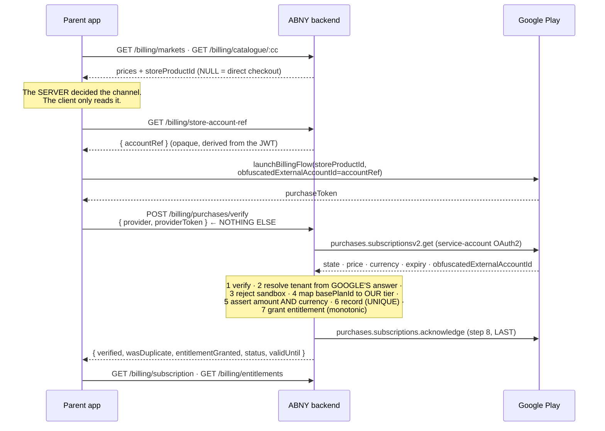

# Google Play Billing — server-authoritative purchase flow

| Document ID | Version | Owner Role | Status | Last Updated |
|---|---|---|---|---|
| PLAY-BILLING-001 | 1.0 | Release Manager | Backend `TEST VERIFIED` (19 executed tests) · Flutter `STATIC VERIFIED` · real Play sandbox **BLOCKED** | 2026-08-17 |

> **Real Play sandbox verification is BLOCKED and is not claimed anywhere.** It
> needs a Play Console account, a published package name, a linked GCP project, a
> service account with the `androidpublisher` scope, a Pub/Sub topic and a licence
> tester. None exists and none was invented. The backend tests mock **Google's two
> HTTP responses** — the OAuth2 token endpoint and `purchases.subscriptionsv2.get`
> — and nothing else. No test in this work stubs a verification decision.

---

## 1. What was wrong

`apps/parent-app/lib/features/billing/presentation/subscription_screen.dart`:

```dart
await ref.read(billingApiProvider).subscribe(planTier, 'MANUAL');
```

The **client** named the tier and the provider, and `MANUAL` is the payment
adapter that always succeeds. **Any parent could grant their household any plan,
for free, by pressing a button**, and no server-side check could tell the
difference — the request was well-formed and authorised.

The backend already had everything needed to do it correctly
(`PHASE-D-Payments-Report.md`): `IPaymentProvider`, `GooglePlayProvider` with a
real `purchases.subscriptionsv2.get` verifier, `PaymentVerificationService` with
its tenant/tamper/sandbox/idempotency checks, and `POST
/billing/purchases/verify` whose DTO carries a token and nothing else. The gap
was entirely on the client path — plus two server-side omissions found while
closing it (§4, §5).

---

## 2. The flow, end to end



**What the client sends: a provider name and an opaque token.** No amount, no
currency, no tier, no `familyId` — `VerifyPurchaseDto` has no field for any of
them, and a test asserts that the class declares exactly two properties, so
adding one is a failing build rather than a review comment.

---

## 3. Store vs direct checkout — the server decides, per price

`HUMAN DECISION REQUIRED #2` (`PHASE-D-Payments-Report.md` §8, ~US$336K/year) is
**not decided here**. The mechanism that expresses the decision already existed:
`subscription_prices.store_product_id` is non-null for a price sold through a
store and null for one sold by us.

`SubscriptionPurchaseCoordinator` reads that field and routes:

| Channel | Client does | Server does | Fee |
|---|---|---|---|
| **STORE** | Play purchase flow → `verifyStorePurchase(token)` | asks Google, derives everything, grants, acknowledges | 15–30% |
| **DIRECT** | `subscribe(tier, gateway)` where *gateway* is the market's `defaultProvider` from `GET /billing/markets` | prices from its own catalogue, creates the charge | 2–3% |

The two paths are separate and clearly sourced, and they meet nowhere except at
`Entitlement`, which is the single source of truth for access regardless of who
paid. The coordinator has **no default and no fallback**: a tier with no
configured price yields `PurchaseChannelKind.unconfigured` and an honest,
translated message. Migration `0014` deliberately seeds **no prices at all**, so
that is the state today, and it is the truthful one.

### 3.1 A real gap this surfaced: the app does not know which market a family is in

`GET /billing/markets` lists the markets the deployment sells in; **nothing in
the parent app records which one a given family belongs to.** When exactly one
market is active the answer is unambiguous and is used. With more than one, the
coordinator throws `PurchaseFailureReason.marketUnknown` rather than guessing —
179 EGP and 179 SAR differ by roughly ten times, and picking the wrong one is a
silent mispricing, not a visible error. **Named, not solved.**

---

## 4. Two server-side defects found and fixed while closing this

**4.1 `acknowledge` was written, tested, and called by nobody.** Google
**automatically refunds and cancels any purchase not acknowledged within three
days.** `GooglePlayProvider.acknowledge` existed since Phase D and no application
service invoked it. The Play path would have verified correctly, recorded
correctly, granted correctly — and had **every purchase silently reversed on day
three**. Nothing would have looked broken until the refunds arrived.

Closed as **step 8** of `PaymentVerificationService`, behind a new
`supports('ACKNOWLEDGE')` capability so the application layer names no provider:

- **It is last.** Acknowledging before the transaction and entitlement exist
  would tell Google "delivered" about access the family does not have — and
  acknowledgement is exactly what closes the automatic-remedy window. This way
  round the worst case is that a family who paid keeps access and Google refunds
  them: bad, visible, recoverable.
- **It never throws.** By then the money is recorded and access is granted;
  failing the request would tell a client whose purchase *succeeded* that it did
  not, and it would retry. A failure logs at `ERROR` with the operator action.
- **It uses the right identifier.** `subscriptionsv2` has no acknowledge method;
  acknowledgement goes through the v1 `purchases.subscriptions` resource, keyed
  on `lineItems[].productId` — **not** on the `basePlanId` that `productRef`
  holds. Two Google identifiers for one purchase; swapping them yields a 404 and
  then a silent refund. A test asserts the exact URL.
- **Already-acknowledged is a no-op**, decided from Google's own
  `acknowledgementState`, because the client path and the RTDN path both
  legitimately arrive for one purchase.

**4.2 The client had no way to obtain the store account reference.**
`resolveTenant` resolves the household from the reference the **store** echoes
back — that is the cross-tenant defence — but nothing served the client a value
to set, so `resolveTenant` would have fallen back to the session (with a logged
warning) on **every** purchase. Closed with `GET /billing/store-account-ref`,
`@OwnerOnly`, derived from the verified JWT, no parameter.

It returns the family UUID rather than an HMAC, deliberately: an HMAC would keep
the internal id off the store — genuinely nicer — and rotating its secret would
orphan **every** existing store link, so every later renewal would resolve to
nobody. A v4 UUID is unguessable, stable for the household's lifetime, 36 of
Play's 64 allowed characters, and exactly what Apple documents `appAccountToken`
for.

---

## 5. Executed backend tests

`apps/backend/test/billing/google-play-client-path.spec.ts` — **19 tests, all
passing**, run against the whole tree (§7).

| Requirement | Tests |
|---|---|
| **token verified → entitlement granted** | tier, amount, currency and tenant all derived from Google; VAT splits exactly; `validUntil` from Google's `expiryTime`; the documented `subscriptionsv2` URL is really called |
| **duplicate token → no second grant** | same token twice → 1 transaction, `wasDuplicate` on the second; 8 concurrent deliveries → 1 transaction + 7 duplicates; one entitlement row per feature; **and** a genuine renewal (new `latestOrderId`, same token) is *not* treated as a duplicate |
| **tampered payload rejected** | amount mismatch → refused, 0 transactions, 0 entitlements, **no acknowledgement**; currency swap → a separate rejection; unmapped base plan → no default tier; cross-tenant token with a valid session → 403; licence-tester purchase → never entitles; invented token → Google's 410 surfaces and the token is not echoed into the error; `UNSPECIFIED` state → fails closed |
| **unconfigured provider fails loudly** | `isConfigured() === false` while still reporting `supports('VERIFY')` — "unconfigured" and "incapable" are different states; throws `PaymentProviderNotConfiguredException`; **makes no network call at all**; each of the three credentials fails on its own |
| **acknowledgement** | acknowledged through the v1 resource at the exact URL; not re-acknowledged when Google says it already is; a failed acknowledgement does **not** revoke an entitlement already granted, and logs `ACKNOWLEDGEMENT FAILED` |
| **negative controls** | the DTO declares **exactly** `provider` and `providerToken` — asserted against the file, because every other test is meaningless if that changes; and the same tier with a different Google answer records different money and different VAT (14% EG vs 15% SA), which a provider that ignored its input could not do |

**Mocked:** Google's two HTTP responses. **Not mocked:** `GooglePlayProvider`,
`PlayDeveloperApiClient` (real RS256 service-account assertion),
`PaymentVerificationService` (all eight steps), `PricingService`,
`EntitlementService`, `PaymentProviderRegistry`. The repositories are the shared
in-memory doubles that **reimplement the real unique constraints**, which is what
makes the duplicate assertions meaningful; the same constraints are proven against
a real PostgreSQL in `test/database/payment-idempotency.integration.spec.ts`.

---

## 6. The Flutter side — `STATIC VERIFIED`, and one dependency NOT taken

| File | Role |
|---|---|
| `features/billing/domain/store_billing_client.dart` | the port: `StoreBillingClient`, `StorePurchase` (one field), `StoreBillingUnavailableException`, and `UnavailableStoreBillingClient` |
| `features/billing/application/subscription_purchase_coordinator.dart` | resolves the channel from the server and routes; four distinct failure reasons |
| `features/billing/api/billing_api.dart` | `verifyStorePurchase`, `getStoreAccountRef`, `getMarkets`, `getCatalogue`, `getEntitlements` |
| `core/di/providers.dart` | `storeBillingClientProvider` — **the one line to change** when the plugin lands |
| `features/billing/presentation/subscription_screen.dart` | `'MANUAL'` removed; four translated messages (ar + en) |

### 6.1 NO NEW FLUTTER DEPENDENCY WAS ADDED — SAYING SO LOUDLY

Obtaining a Play `purchaseToken` requires **either** the `in_app_purchase` plugin
**or** a platform channel onto Android's `BillingClient`. **Neither is in this
repository, and neither was added.** The reason is specific, not squeamishness:

- `pub.dev` is unreachable here, so a new constraint cannot be resolved, let
  alone locked;
- neither app commits a `pubspec.lock` (audit PA-M-016), so resolution already
  follows a **date** rather than a commit;
- `in_app_purchase`'s Android side has historically raised the required
  `compileSdk`, and `android/settings.gradle` pins AGP 8.1.1, which refuses
  `compileSdk` above 34.

An unresolvable, unlockable dependency could break **the first `flutter build`**
— the single most valuable unmeasured thing in the project — and it would break it
in a way that reads as "the build is broken", not as "this decision was wrong".

**So `UnavailableStoreBillingClient` refuses and says exactly what is missing,
and the UI shows a translated sentence ending in "nothing has been charged". It
does not fall back to a path that grants a paid tier without a payment. That
fallback is what was there before.**

This is a **REMAINING ITEM**, not a design: on a machine that can reach
`pub.dev`, add the plugin (or the channel), implement `StoreBillingClient`, and
change one line in `core/di/providers.dart`. Nothing else in the app references a
store SDK.

---

## 7. Configuration

Backend (`apps/backend/.env.example`, already documented there):
`GOOGLE_PLAY_SERVICE_ACCOUNT_EMAIL`, `GOOGLE_PLAY_SERVICE_ACCOUNT_PRIVATE_KEY`,
`GOOGLE_PLAY_PACKAGE_NAME`, `GOOGLE_PUBSUB_AUDIENCE`,
`GOOGLE_PUBSUB_SERVICE_ACCOUNT`. All empty; each missing one makes the adapter
report `isConfigured() === false` and throw at the point of use.

Play Console, per plan × period: an auto-renewable subscription whose **base plan
id** equals a `subscription_prices.store_product_id` row. An unmapped base plan
grants nothing — there is no default. **The prices themselves are `HUMAN DECISION
REQUIRED #1` and are deliberately unseeded.**

---

## 8. What remains `BLOCKED` or `HUMAN DECISION`

| Item | State |
|---|---|
| Play sandbox verification against real Google servers | **BLOCKED** — no Console, package, GCP project, service account, Pub/Sub topic or licence tester |
| A Play Billing client in the Flutter app | **REMAINING** — needs a dependency decision on a machine that can resolve it (§6.1) |
| Store vs direct checkout | **HUMAN DECISION #2** — expressed per price by `store_product_id`; not decided in code |
| Actual prices | **HUMAN DECISION #1** — `subscription_prices` is empty and a test keeps it that way |
| Which market a family is in | **REMAINING GAP** — §3.1; refuses to guess |
| Pub/Sub push OIDC signature (RS256 vs JWKS) | **KNOWN LIMITATION**, `PHASE-D-Payments-Report.md` §10.2 — acceptable only because an RTDN is a doorbell; unchanged here |
| Daily reconciliation job | **NOT BUILT** — `PHASE-D` risk 5. It is also what would rescue an unacknowledged purchase, so §4.1 raises its value |
| `applicationId` / package name | **HUMAN DECISION** — immutable after the first upload; governs the Play product itself |
